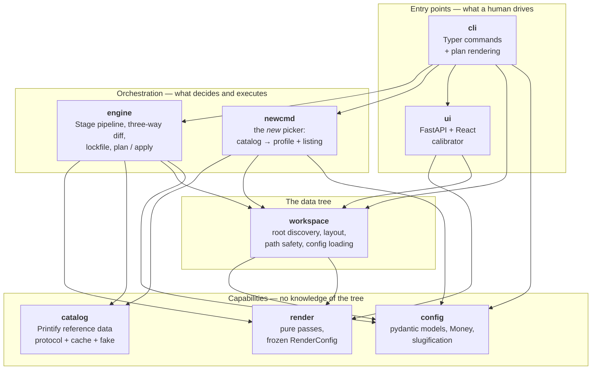
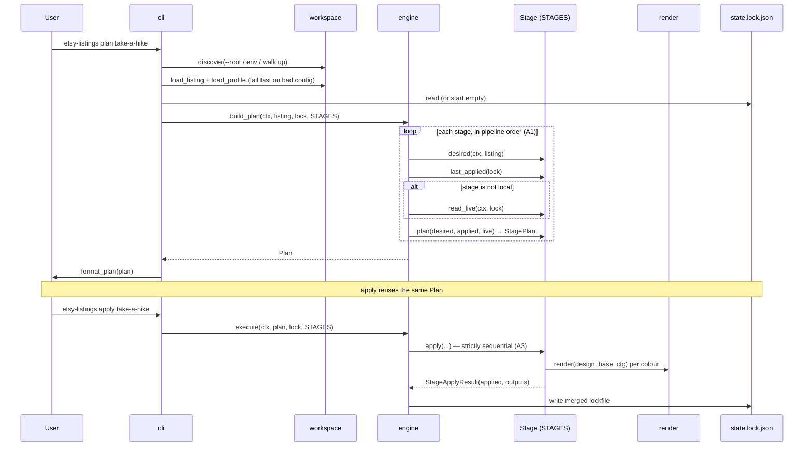
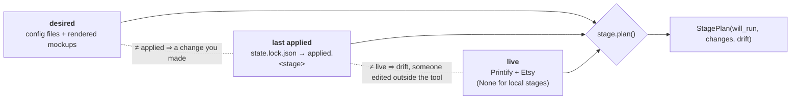
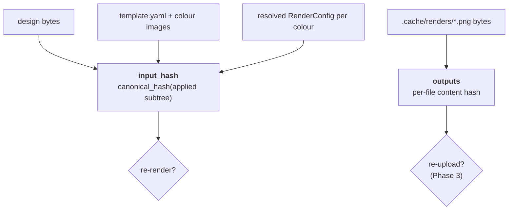
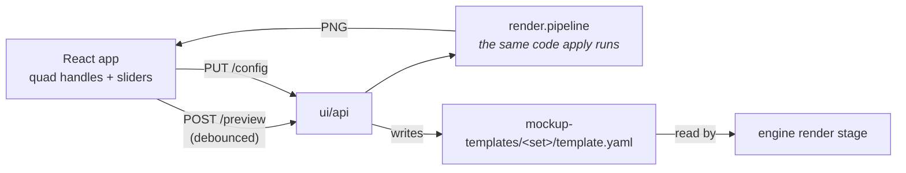

# Architecture

Companion to [prd.md](prd.md) (*what*) and [implementation-plan.md](implementation-plan.md)
(*how*). This document describes the system as it exists today — after Phase 0
and Phase 1. It shows mechanism, not a restatement of the directory listing,
and it is kept in step with the code rather than with the plan.

## The eight modules

Dependencies point strictly downward; there are no cycles. `render`, `catalog`
and `config` know nothing about workspaces, listings or each other, which is
what makes them testable in isolation — and what lets `render` be pure.

`workspace` depends on both `config` and `render` for the same reason: it knows
where every file lives, and asks whichever module owns a file's *shape* to
parse it. `shop.yaml`, `listing.yaml` and the pricing plans are `config`'s;
`template.yaml` is `render`'s, because it is render geometry and render
settings from top to bottom. The arrow only ever points that way — `render`
still has no idea a workspace exists.

| Module | Owns | Deliberately does *not* |
|---|---|---|
| `cli` | Typer commands; turning a `Plan` into terminal text | Compare state, or know the directory layout |
| `ui` | The calibrator's HTTP API and its React front end | Contain a second execution path — it calls the same renderer |
| `engine` | Stage protocol, the three-way diff, the lockfile and its hashing | Format output, or talk HTTP directly |
| `newcmd` | Turning a catalog choice into a profile + listing stub | Prompt (that is a thin questionary shell over pure logic) |
| `workspace` | Where every file lives, path safety, loading config | Know what a render or a Printify product is |
| `render` | warp → displace → shade → export, and derived maps | Any I/O, globals or clock (A7) |
| `catalog` | Printify blueprint/provider/variant reads, TTL cache, name→id | Anything shop-scoped or authenticated |
| `config` | `shop.yaml` / profile / listing models, `Money`, slugs | Know where those files are on disk |

Three boundaries carry most of the weight:

- **`workspace` is the only module that knows the tree's shape.** Everything
  else asks for "this listing's lockfile" rather than joining
  `listings/<name>/state.lock.json`. That is also what makes the UI safe:
  template names arriving from URLs are validated by the same rule that guards
  every other path (A8), not by a second check in the web layer. Reading a
  config file is part of that: `load_listing`, `load_profile` and
  `load_template_config` are how the tree's files are opened, so no caller
  writes its own `yaml.safe_load(path.read_text(...))` against a path it
  assembled.
- **Only `engine` computes a diff.** `cli` and (later) `ui` consume `Plan` /
  `StagePlan` / `Change` objects and render them. Neither compares state, which
  is what guarantees the PRD's "one set of rules regardless of route".
- **`render` is pure.** Arrays and frozen config in, an image out. The stage
  around it does the I/O. This is what makes both the input hash and the
  goldens meaningful.

## What `plan` and `apply` actually do

Today `STAGES` is `[Render()]`. Adding `Generate`, `PrintifyProduct`,
`Publish`, `EtsyCopy` and `EtsyMedia` in later phases changes that list, not
this flow.

## The three-way comparison

Each stage's own `plan()` compares three states using the shared helpers in
`engine/change.py`:

`read_live()` returning `None` (`stage.local = True`) skips drift entirely, so
no stage has to special-case it. The render stage is local: there is no remote
mockup to drift from.

## Two hashes, doing different jobs

Collapsing these into one hash breaks the case the PRD calls out: a Pillow or
OpenCV upgrade changes rendered bytes without changing any input, and those
images must re-upload. `applied_at`, `tool_version`, `remote` and absolute
paths never enter a hash; paths that do are workspace-relative and
forward-slashed, so a Windows machine and a Linux runner agree.

## The calibrator

The preview is the real renderer, not an approximation — that is the whole
point of calibrating in a browser. `template.yaml` is the artefact the
calibrator produces and the render stage consumes; nothing else passes between
them.

"Real renderer" is now structural rather than a claim maintained by hand. Both
routes ask `Workspace.scene_photo()` which photo a scene composites over and
what its derived maps cache under, and both composite through
`render_scene()`. The one thing the preview does differently is where its
geometry comes from — the unsaved boxes under the user's cursor, not the file
on disk — which is exactly the difference that makes it a preview.

## Testing layers

| Layer | Answers |
|---|---|
| Unit | Does this function obey its contract? (`Money`, slugs, hashing, path safety) |
| Golden | Did the pixels change, and which pass changed them? |
| Behaviour | Does plan/apply do the right thing over time? (idempotency, re-render on change) |
| Browser | Do the React app, the API and the renderer work together? |
| Contract | *(Phase 2+)* Does the wire payload match what the API expects? |
| E2E | *(Phase 2+)* Does it work against the real Printify and Etsy? |

Reach for a fake to test behaviour and a cassette to test payload shape. The
browser layer exists because nothing below it can catch a wiring mistake
between three otherwise-tested pieces.
