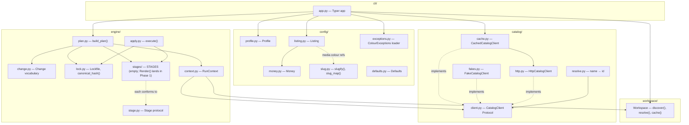
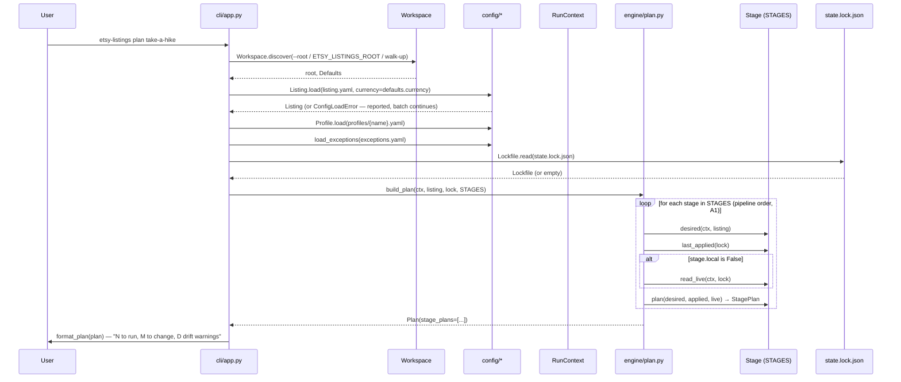
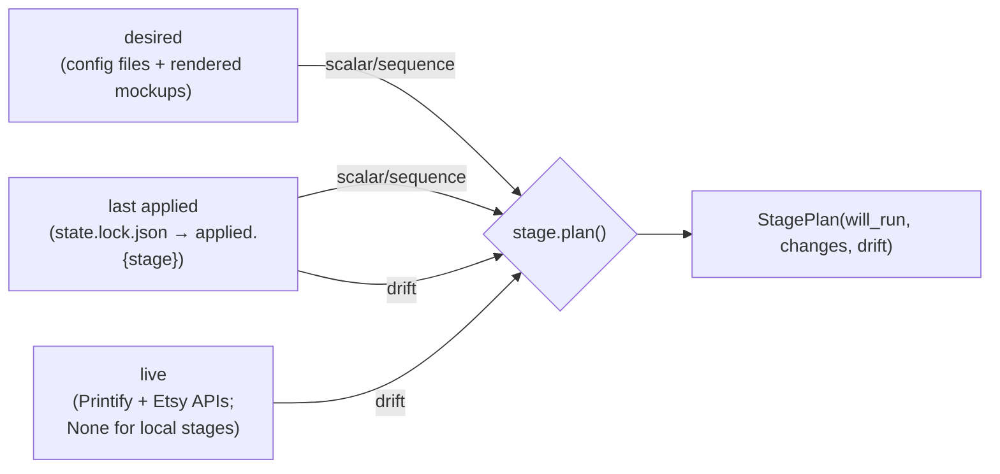

# Architecture

Companion to [prd.md](prd.md) (*what*) and [implementation-plan.md](implementation-plan.md)
(*how*). This document shows the mechanism that actually exists after Phase 0:
module boundaries and the plan/apply data flow. It grows as later phases land;
it is not a restatement of the directory listing.

## Package structure

Only `engine` computes a diff (`plan.py` / `apply.py`, via each stage's own
`plan()`). The CLI's `format_plan()` renders the `Plan` / `StagePlan` / `Change`
objects that come back; it never compares state itself. A future UI JSON
serialiser will consume the same objects, which is what keeps the two surfaces
enforcing identical rules (A2).

## `plan` data flow

Phase 0's `STAGES` list is empty, so this loop runs zero times and `plan`
always reports "no stages configured" — the empty-plan skeleton the exit
criterion asks for. Phase 1 adds `Render()` as the first real stage; the loop
shape above does not change when it does.

## Three-way comparison (target shape, PRD)

Once a stage exists, its `plan()` compares three states using the shared
`engine/change.py` helpers (`scalar`, `sequence`, `drift`):

`desired ≠ applied` is a change you made locally; `applied ≠ live` is drift —
someone edited outside this tool. `read_live()` returning `None` (`stage.local
= True`) skips the drift comparison entirely rather than every stage having to
special-case it.

## Hashing (`engine/lock.py`)

Only the lockfile's `applied` subtree is hashed, through the single
`canonical_hash()` helper — `applied_at`, `tool_version`, `remote` and absolute
paths never enter it. Any path that does enter hashed content must first pass
through `to_workspace_relative_posix()`, which is what keeps the hash identical
between a Windows machine and a Linux CI runner for the same content.
