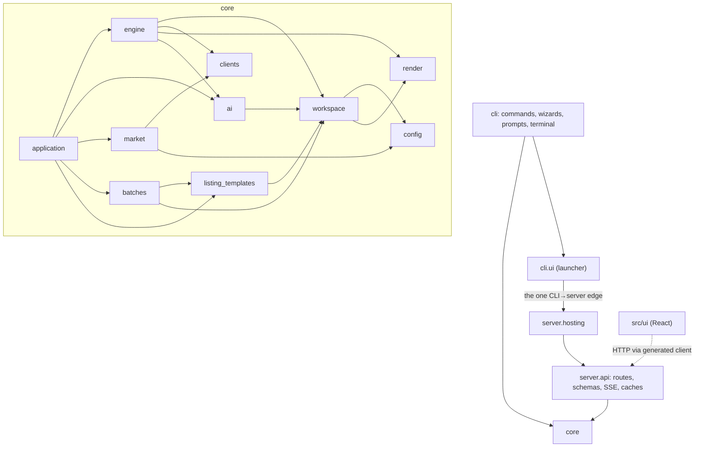
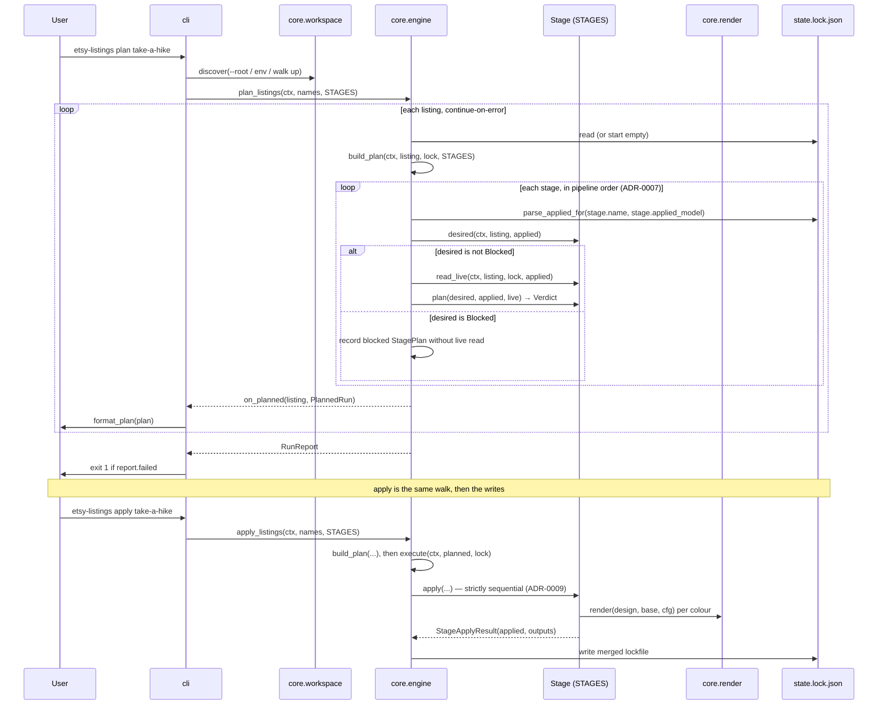
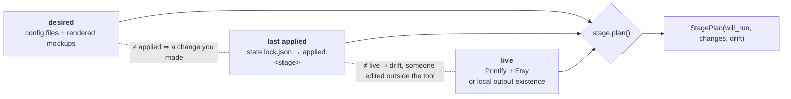
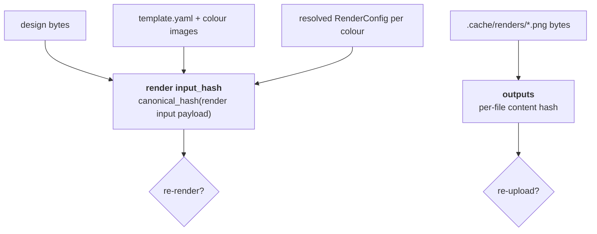
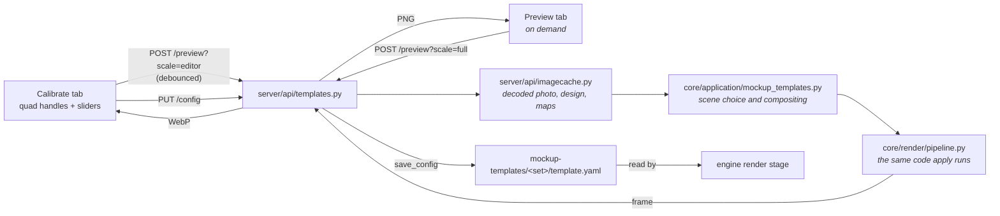

# Architecture

This is the living description of module boundaries, data flow and invariants.
Feature requirements live in the [documentation index](README.md#features);
decision rationale lives in [ADRs](adr/README.md). The
[original PRD and plan](README.md#history) are retained as historical snapshots.

Last audited against the implementation on 2026-10-02, after the
[module-structure restructure](features/module-structure-20260930/spec.md)
(ADR-0052). The 2026-09-30 [audit report](research/architecture-audit-20260930.html)
records the evidence behind the finding ids (F02, F04, …) cited below; the
invariants describe intended contracts and name the known gaps rather than
claiming every caller already obeys them.

Module paths in this document are relative to `src/etsy_listings/` unless they
start with `src/`, `tests/`, `scripts/` or `docs/`.

## Runtime and dependencies

The application is a synchronous Python 3.12+ backend with a FastAPI server, a
Typer CLI and a React/TypeScript SPA, shipped as one Python distribution.
`pyproject.toml` declares runtime dependencies and `uv.lock` records the Python
resolution; `src/ui/package.json` and `package-lock.json` do the same for Node.
Versions here describe this checkout, not the latest vendor releases.

| Area | Dependencies and current role |
|---|---|
| CLI and documents | Typer (locked 0.27.2, Click 8.5.0 transitively), pydantic v2 (2.13.5), pydantic-settings and PyYAML; questionary is used only through `cli/prompts.py` with a plain-input fallback |
| HTTP clients | httpx (0.28.1); vendor protocols and shared retry policy, without vendor SDKs |
| Images | `opencv-python-headless==4.10.0.84`, `pillow==10.4.0`, and NumPy (locked 2.5.2, currently supplied transitively by OpenCV); pure numerical passes plus explicit I/O/cache adapters |
| Videos | PyAV (`av>=15`, locked 18.1.0) probes streams, dimensions and duration; the tool uploads original video bytes rather than encoding them |
| Web server | FastAPI (0.141.1), python-multipart and uvicorn; `ui` runs the application under uvicorn in the foreground and the user opens the printed URL in any browser |
| Frontend | React/React DOM 19, React Router 7, Phosphor icons and openapi-fetch; TypeScript 5 and Vite 8 build the SPA; openapi-typescript generates `src/ui/src/api/schema.ts` from `docs/openapi.json` (ADR-0011) |
| Development | uv/hatchling, ruff, strict mypy, Import Linter, pytest/pytest-cov, Playwright; frontend ESLint, Prettier, Vitest, Testing Library and V8 coverage; marver is a design dependency |
| AI processes | Installed, signed-in `codex`, `claude` and `grok` CLIs, invoked behind `AiProvider`; these are external executables, not Python SDK dependencies |

There is no native window or GUI toolkit: the module-structure specification
removed pywebview and the `--browser`/`--debug` flags, and that removal is the
restructure's only user-visible change. NumPy, Starlette, prompt_toolkit and
pydantic-core are imported directly but currently arrive through other
declared dependencies; the audit distinguishes that coupling from a missing
dependency at runtime.

## Source layout and dependency direction

```text
src/
  etsy_listings/        one Python distribution; __init__ holds only VERSION
    core/               transport-independent backend
      application/      operations shared by server and CLI; deploy/ and ai/ coordinators
      engine/ workspace/ render/ clients/ config/ ai/ market/ batches/ listing_templates/
      connections.py    client and RunContext construction
      errors.py         UserFacingError, the user-facing error base
    server/             FastAPI app (api/), startup (hosting.py), packaged SPA (static/, wheels only)
    cli/                Typer commands, wizards, prompts, terminal; ui.py launches the server
  ui/                   npm project: React source, colocated Vitest tests, dist/ build output
```


```mermaid
graph TD
    CLIUI["cli.ui (launcher)"] -->|"the one CLI→server edge"| HOSTING["server.hosting"]
    CLI["cli: commands, wizards, prompts, terminal"] --> CORE
    CLI --> CLIUI
    HOSTING --> API["server.api: routes, schemas, SSE, caches"]
    API --> CORE["core"]
    SPA["src/ui (React)"] -. "HTTP via generated client" .-> API
    subgraph CORE_INSIDE [core]
        APP["application"] --> ENGINE["engine"]
        APP --> AIP["ai"]
        APP --> MARKET["market"]
        APP --> BATCHES["batches"]
        APP --> TEMPLATES["listing_templates"]
        ENGINE --> WORKSPACE["workspace"]
        ENGINE --> CLIENTS["clients"]
        ENGINE --> RENDER["render"]
        ENGINE --> AIP
        BATCHES --> TEMPLATES
        BATCHES --> WORKSPACE
        TEMPLATES --> WORKSPACE
        AIP --> WORKSPACE
        MARKET --> CLIENTS
        MARKET --> CONFIG["config"]
        WORKSPACE --> CONFIG
        WORKSPACE --> RENDER
    end
```

Core depends on neither adapter. Server and CLI each depend on core and never
on each other, with one deliberate exception: `cli/ui.py` imports
`server.hosting.serve` inside the command body, so registering commands in
`cli/app.py` loads neither FastAPI nor uvicorn. The internal core graph shows
the main flows rather than every import and is not a strict layered tree. The
engine imports the AI proposal store to clear accepted or discarded proposals
after a full apply. `application/ai` composes AI tasks with market research;
`ai` does not itself import `market`. `config.market_weights` owns the
settings value types research consumes, and config does not import market.

Every package `__init__.py` documents its public interface and what it
withholds. Nothing is re-exported from `etsy_listings`, `core` or
`core.application`: a caller imports the module it depends on, so importing a
package never drags in OpenCV, FastAPI or Typer to reach one name.

| Module | Owns | Boundary |
|---|---|---|
| `cli` | Typer commands, terminal presentation of engine reports (`cli/render.py`), command options, prompts and the `auth`/`setup`/`new` wizards' question order (`cli/auth.py`, `cli/setup.py`, `cli/new.py`, with `cli/credentials.py` and `cli/pickers.py`) | Uses engine reports rather than computing a second diff; wizards call core operations for every decision and write; only `cli/ui.py` imports the server, and only `server.hosting` |
| `server` | FastAPI routing and wire schemas (`server/api/`), HTTP status mapping, SSE framing, reconnect and disconnect polling, request-serving caches (`imagecache`, `etsystate`, thumbnails), static SPA serving and app startup/shutdown (`server/hosting.py`, the lifespan in `server/api/app.py`) | Constructs one of each core coordinator, store and lock set per process and starts and stops them; decides no workflow rule itself |
| `core/application` | Operations shared by server and CLI: listing reads, edits, creation, rename/delete and pricing plans; the wizards' reusable operations (credentials, workspace setup, shop discovery, garment profiles); mockup-template calibration and preview scenes; listing-template library; batch staging and workflow; per-listing-template write locks; deployment runs (`deploy/`); AI runs, batch AI queue, readiness and proposals (`ai/`); host-supplied seams (`dependencies.py`) and typed refusals (`refusals.py`) | Owns the records that follow a listing or listing template, and locking around listing-template writes; listing documents and listing-keyed files are edited only through `core/workspace/listing_documents.py` and `core/listing_artifacts.py`; answers with results or typed refusals, never status codes or terminal text; constructing a coordinator starts no thread; takes decoded images and upload streams, never request objects or caches |
| `core/engine` | Stage protocol, comparison, lockfile, lifecycle, runs, previews and status | Stages return values; the engine decides execution and records progress |
| `core/workspace` | Root discovery, layout, reference resolution, file loading, atomic writes, video probes, Cygwin path translation and request facts; `listing_documents.py` is the one reader and writer of `listing.yaml` and holds each listing's process-wide lock | Owns workspace layout and containment; callers may do I/O on paths it supplies, except `listing.yaml`, which every writer edits through `ListingDocuments` |
| `core/listing_artifacts.py` | Moving and removing everything keyed by a listing's name: its directory, render cache, previews, market snapshot and cached proposal | One list serves rename, wipe and a pending delete; every operation holds the listing's lock. Batch rows and AI runs stay with `core/application/listing_identity.py` |
| `core/render` | Configuration and pure image passes | No workspace knowledge; callers supply images and geometry |
| `core/clients` | Typed protocols, transports, Printify catalog/product and Etsy APIs, OAuth tokens and fakes | Shared transport per vendor; separate caller authority through protocols |
| `core/config` | Validated documents, settings, money, slugs, secrets and local listing refusals | No knowledge of directory layout; path-based loaders and the design-resolution check currently perform file I/O |
| `core/ai` | Provider calls, prompts, saved-listing inputs, validation and cached proposals | Requests and comparison snapshots share one interpretation of saved facts; suggestions enter listing content only through acceptance |
| `core/listing_templates` | Template conversion and frozen document/assets/timestamp capture | Capture occurs under the template write lock before upload; shared references are revalidated at confirm and retry |
| `core/market` | Comparable-listing research, scoring and evidence snapshots | Read-only Etsy data informs wording rather than product facts |
| `core/batches` | Upload validation, archive inspection, staging, name allocation and idempotent local creation | Creates ordinary listings; AI dispatch belongs to `application/ai` |
| `core/connections.py`, `core/errors.py` | Client and `RunContext` construction; `UserFacingError` | See the credential invariant below |

Three boundaries carry most of the weight. Only `core/workspace` knows the
data tree, including how to enumerate it. Only `core/engine` computes
deployment changes and folds a run's lockfile. Render passes are pure, so
input hashes and golden images describe deterministic work shared by
calibration and deployment.

### Clients, credentials and prompts

`core/connections.py` builds clients and `RunContext`. Printify tokens and Etsy
bearers resolve at request time, but the Etsy app key pair is read during
construction to decide whether an optional client exists. The server injects
`connections.run_context` into `Deployments` as an
`application.dependencies.ContextFactory`, and the AI coordinator receives
its market client through `MarketClientFactory`; tests pass factories wired
to the in-memory fakes.

`core/application/credentials.py` owns finding, verifying and storing a
credential and both halves of the Etsy grant around the browser step;
`cli/credentials.py` owns asking for one and saying what happened.
`cli/prompts.py` chooses the terminal backend and handles cancellation;
`cli/terminal.py` is a standard-library leaf for encoding and presentation.
None of the three CLI modules is importable from core.

## What `plan` and `apply` actually do


```mermaid
sequenceDiagram
    participant User
    participant CLI as cli
    participant WS as core.workspace
    participant Engine as core.engine
    participant Stage as Stage (STAGES)
    participant Render as core.render
    participant Lock as state.lock.json

    User->>CLI: etsy-listings plan take-a-hike
    CLI->>WS: discover(--root / env / walk up)
    CLI->>Engine: plan_listings(ctx, names, STAGES)

    loop each listing, continue-on-error
        Engine->>Lock: read (or start empty)
        Engine->>Engine: build_plan(ctx, listing, lock, STAGES)

        loop each stage, in pipeline order (ADR-0007)
            Engine->>Lock: parse_applied_for(stage.name, stage.applied_model)
            Engine->>Stage: desired(ctx, listing, applied)
            alt desired is not Blocked
                Engine->>Stage: read_live(ctx, listing, lock, applied)
                Engine->>Stage: plan(desired, applied, live) → Verdict
            else desired is Blocked
                Engine->>Engine: record blocked StagePlan without live read
            end
        end

        Engine-->>CLI: on_planned(listing, PlannedRun)
        CLI->>User: format_plan(plan)
    end

    Engine-->>CLI: RunReport
    CLI->>User: exit 1 if report.failed

    Note over User,Lock: apply is the same walk, then the writes
    User->>CLI: etsy-listings apply take-a-hike
    CLI->>Engine: apply_listings(ctx, names, STAGES)
    Engine->>Engine: build_plan(...), then execute(ctx, planned, lock)
    Engine->>Stage: apply(...) — strictly sequential (ADR-0009)
    Stage->>Render: render(design, base, cfg) per colour
    Stage-->>Engine: StageApplyResult(applied, outputs)
    Engine->>Lock: write merged lockfile
```

The normal pipeline is `RenderStage`, `PrintifyProductStage`, `PublishStage`,
`EtsyListingStage`, `EtsyMediaStage`, then `EtsyVideosStage`, as exported by
`core/engine/stages/__init__.py`. Lifecycle handling selects a retract or
retire/resume path when needed. AI proposals are an editor workflow rather
than an engine generation stage.

After each successful stage, execute records the folded lockfile. Later stages
receive newly minted remote ids while still comparing against the previous
run's applied documents. A failure retains progress with an incomplete marker
so the next run can resume. Reviewed browser applies replan and verify the
plan fingerprint before executing; run resources stream progress and allow a
browser to reattach.

## The three-way comparison

Each stage's own `plan()` compares three states using the shared helpers in
`core/engine/change.py`:


```mermaid
graph LR
    D["<b>desired</b><br/>config files + rendered mockups"] --> Diff{"stage.plan()"}
    A["<b>last applied</b><br/>state.lock.json → applied.&lt;stage&gt;"] --> Diff
    L["<b>live</b><br/>Printify + Etsy<br/>or local output existence"] --> Diff
    Diff --> SP["StagePlan(will_run, changes, drift)"]

    D -. "≠ applied ⇒ a change you made".- A
    A -. "≠ live ⇒ drift, someone edited outside the tool".- L
```

`local = True` means there is no remote drift to report; it does not suppress
`read_live()`. Render reads the existence of previously applied output files
and recorded scene hashes, returning `RenderLive` when applied state exists.
It reports missing local outputs as work to redo. `None` can also mean a remote
resource has not yet been created; each stage interprets its own live type.

## Two hashes, doing different jobs


```mermaid
graph TD
    Design["design bytes"] --> IH
    Template["template.yaml + colour images"] --> IH
    Cfg["resolved RenderConfig per colour"] --> IH
    IH["<b>render input_hash</b><br/>canonical_hash(render input payload)"] --> Rerender{"re-render?"}

    Png[".cache/renders/*.png bytes"] --> OH["<b>outputs</b><br/>per-file content hash"]
    OH --> Reupload{"re-upload?"}
```

Separate hashes allow changed rendered bytes to trigger uploads independently
of input changes. They do not themselves force a re-render after a library
upgrade: current input and scene hashes have no renderer revision, so existing
renders and previews can survive such a change. Exact library pins constrain
this risk; an intentional renderer/library change needs cache invalidation
until that gap is repaired. `applied_at`, `tool_version`, `remote` and absolute
paths never enter a hash; paths that do are workspace-relative and
forward-slashed, so a Windows machine and a Linux runner agree.

`Lockfile.input_hash()` hashes the whole applied subtree. The render stage also
hashes its own input payload and each scene payload. Reviewed applies hash the
presentation `Plan` and stable stage review-input digests without snapshots;
cache and OAuth code use hashes for other purposes. The restriction on
volatile deployment inputs is not a ban on those separate keys. Render stages
expose their input digest through the optional `review_hash` hook:
design/photo/template-byte edits invalidate a reviewed apply even when action
paths and reasons remain identical (ADR-0039). Preview completion and
transient CDN URLs remain excluded from review identity.

## The calibrator


```mermaid
graph LR
    Canvas["Calibrate tab<br/>quad handles + sliders"] -->|"POST /preview?scale=editor<br/>(debounced)"| API["server/api/templates.py"]
    Tab["Preview tab<br/><i>on demand</i>"] -->|"POST /preview?scale=full"| API
    API --> Cache["server/api/imagecache.py<br/><i>decoded photo, design, maps</i>"]
    Cache --> Op["core/application/mockup_templates.py<br/><i>scene choice and compositing</i>"]
    Op --> RenderPipe["core/render/pipeline.py<br/><i>the same code apply runs</i>"]
    RenderPipe -->|"frame"| API
    API -->|WebP| Canvas
    API -->|PNG| Tab
    Canvas -->|"PUT /config"| API
    API -->|"save_config"| Yaml["mockup-templates/&lt;set&gt;/template.yaml"]
    Yaml -->|read by| Stage["engine render stage"]
```

The preview is the real renderer, not an approximation — that is the whole
point of calibrating in a browser. `template.yaml` is the artefact the
calibrator produces and the render stage consumes. Separately, browser
deployment plan runs call `preview_listing()` after planning and write
full-size, content-addressed previews. Apply copies a matching preview into
render outputs instead of rendering again, retaining the preview for
reattachment (ADR-0040). Those deployment previews are distinct from the
calibrator's HTTP previews.

"Real renderer" is structural rather than a claim maintained by hand. Both
paths ask `Workspace.scene_photo()` which photo a scene composites over and
what its derived maps cache under, and both composite through
`render_scene()`. The one thing the preview does differently is where its
geometry comes from — the unsaved boxes under the user's cursor, not the file
on disk — which is exactly the difference that makes it a preview.
`application.mockup_templates` decides the scene (photo, layers, design) and
composites it from decoded images the server supplies out of its memo;
encoding the frame as WebP or PNG is the server's.

### Two sizes, one pipeline

A drag emits a preview request every few frames, and at a real garment photo's
resolution each one re-decoded the mockup PNG and the design PNG from disk,
warped at full size, and PNG-encoded several megabytes — seconds of work per
frame, for an image about to be replaced. So the two things a preview is *for*
were separated:

| | Calibrate tab | Preview tab |
|---|---|---|
| Request | `?scale=editor` | `?scale=full` |
| Base | downscaled to `EDITOR_MAX_EDGE` (900px) | the photo's own size |
| Encoding | WebP, low effort | `encode_png`, as `apply` writes |
| When | debounced, one in flight at a time | on opening the tab, then only on Re-render |

Both run `render_scene()` over the same photo and derived maps. What differs
is how many pixels the server is asked to spend, which is why the fast one is
still honest: it is the output, at a size you can drag against.

The Preview tab renders itself on first sight and then holds still. A config
edit afterwards does not re-run it — a full-size set is minutes of work, and a
nudged box is not a request for it — but it must not silently become a picture
of geometry that has moved on either, so Re-render turns red. The panel stays
mounted behind the canvas rather than unmounting, or flicking between tabs
would throw the renders away and "there is none, so render" would fire on a
set that had just been rendered.

Two consequences worth knowing:

- **Bounding boxes stay in the photo's true pixel space.** `template.yaml`
  stores them there, so `application.mockup_templates.scaled` scales them (and
  `displace.strength`, which is denominated in absolute pixels) onto the
  smaller canvas, and the client is *told* the true size in
  `TemplateSummary.width`/`height` rather than measuring the image it is
  drawing over. Measuring it would save every box a few times too small, with
  nothing on screen looking wrong.
- **`server/api/imagecache.py` memoises what the loop re-reads** — the decoded
  photo at each size, the decoded design, and the derived maps — keyed on path
  and mtime, bounded by total bytes rather than entry count. It is request-serving
  infrastructure, so it sits in `server`, not in `core/render/io.py` or the
  calibrator operation: the render stage reads each file once per run and
  needs no cache, and giving it one would put mutable process state under the
  pure layer for nobody's benefit.

## Server lifecycle, runs, AI and batch creation

`etsy-listings ui` runs `cli/ui.py`, which opens the workspace and calls
`server.hosting.serve`; that runs `create_app(workspace)` under uvicorn on the
main thread, which owns Ctrl-C. `create_app` constructs one `WorkspaceLocks`,
`ProposalStore`, staging and batch store, `AiCoordinator`
(`core/application/ai`: run registry, runner and batch queue) and
`Deployments` (`core/application/deploy`: registry, FIFO executor and review
check) per server process. Constructing them starts nothing. The lifespan
sweeps expired staging, starts deployments, then starts AI work (returning
interrupted batch rows to the queue). On shutdown it stops AI work first — the
batch queue starts nothing more, then every run is cancelled and its provider
subprocess tree killed — and then stops deployments: a queued run is
cancelled, a plan stops at its next safe point and an apply finishes its
current stage, recording it (ADR-0037). uvicorn waits for the lifespan without
a timeout.

FastAPI serves the generated-contract routes and the built SPA. React Router
provides the dashboard, listings and editor, individual/workspace deployment,
listing-template editor, batch upload/staging/summary and mockup calibrator
routes (`src/ui/src/main.tsx`). Setup and authentication remain terminal
workflows, not a web setup wizard.

Deployment uses one FIFO worker for the workspace. The registry reserves
listing names when a run is queued; reviewed applies carry fingerprints and
the exact reviewed listing set, checked by `Deployments.submit` before
anything is queued (ADR-0039, ADR-0042). Core owns run identity, event
buffering, retention and the blocking `wait_for_events`; `server/api/runs.py`
and `server/api/airuns.py` translate requests into commands, frame events as
SSE, honour `Last-Event-ID` replay and poll for disconnects. Closing an SSE
connection never cancels work. AI runs have their own registry and thread per
run, with cancellation propagated to provider subprocess trees. Both registries
live in memory and are lost on process restart; listing state, cached
proposals and batch records persist on disk. There is no run-history recorder.

The AI runner optionally drafts an empty brief, extracts three buyer queries,
researches comparable Etsy listings, then generates and validates a proposal.
The default provider order is Codex, Claude, Grok, with availability fallback,
one same-provider repair for invalid output and a shared deadline. Readiness
(`application/ai/readiness.py`) decides whether a run may start. Market
search/stat caches live for seven days; the latest per-listing evidence
snapshot is separate. Research is read-only and supplies wording evidence
rather than new garment facts (ADR-0044). The runner may save an automatically
drafted brief after rechecking that it is still empty; SEO suggestions enter
the listing through the seller's acceptance workflow (ADR-0003).

`ProposalStore` retains one latest proposal with its input snapshot,
generation time, origin and per-section resolutions. Staleness is judged on
every read (`core/application/ai/listing_proposals.py`), never stored; stale
proposals remain reviewable. A proposal is persisted before its streamed
event, and full successful apply clears it through the engine, including CLI
apply (ADR-0049, ADR-0050).

Listing templates are distinct from mockup templates: they capture commercial
configuration and media references, while mockup templates define render
geometry. Upload staging freezes the selected listing-template document and
owned assets under its write lock. The server decodes multipart uploads into
byte streams; bounded loose-PNG/ZIP inspection in `core/batches` precedes
review. Confirm and retry revalidate shared references and allocate names
under the listing's document lock. They create ordinary listings and retained batch records,
idempotently, without deploying (ADR-0047, ADR-0051). Staging expires seven
days after its last edit and is swept at startup. `BatchQueue` dispatches
queued rows through the existing AI runner, defaults to one concurrent batch
row, reads the workspace concurrency setting, round-robins across batches and
recovers interrupted rows on restart (ADR-0048).

Before a browser plan or apply begins, `Deployments` yields its listings to the
`AiCoordinator`, which cancels their queued batch AI, stops and awaits active
AI, and holds those names against new AI until deployment ends (ADR-0050).

### Process-local limitations

These are preserved deliberately; the restructure moved them into core without
changing them. The listing document locks (`ListingDocuments.lock`) serialize
every `listing.yaml` edit, proposal record write and listing rename or removal,
including the engine's, and `WorkspaceLocks` serializes listing-template writes,
inside one process only. Deployment and AI registries hold runs in
memory. There is no cross-process lock protecting concurrent CLI and server
writes, no shared registry across multiple ASGI workers or servers on one
workspace, and CLI `apply` neither consults nor joins the server's queue.
Atomic file replacement prevents torn files; it does not prevent lost updates.

## Workspace references and media ownership

`Workspace.discover()` honors an explicit root, then `ETSY_LISTINGS_ROOT`, then
walks upward for `shop.yaml`; user data belongs outside the application checkout.
The layout includes garment/pricing profiles, common media/copy, test designs,
prompts, listing templates and `settings.yaml` as well as the original listing,
design and mockup directories. Cache accessors cover catalog data, renders,
previews, market evidence, proposals, staging sessions and batch records.

File references without a prefix resolve from the workspace root. `./` resolves
from the owning listing or listing-template directory; subdirectories are
allowed, while absolute paths, backslashes and `..` segments are refused
(ADR-0046). Reference resolution checks the resolved target against the root.
Layout names are validated as single segments, but not all layout accessors
check symlink/junction containment; that remaining gap is audit finding F02.

The ordered `media` gallery combines explicit rendered scenes with image/video
file references (ADR-0045). Images use content hashes and an ordered remote-id
manifest; variation images use the configured template (ADR-0030, ADR-0031).
The video stage follows images because attachment position depends on image
count. PyAV facts feed shared local video checks before original bytes are
uploaded; vendor slot/budget refusals remain distinct from local validation.
Printify creates the Etsy draft; Etsy stages then own copy, image and video
updates. Selective publish flags and field ownership prevent Printify from
overwriting Etsy-owned content (ADR-0001, ADR-0021).

## Invariants

These are the things that are easy to break by accident and expensive to notice
later. Each traces to a decision.

### Engine and stages

- **Only `core/engine` computes a diff.** The CLI renderer and the server's
  serialiser both consume `Plan` / `StagePlan` / `Change` objects. Neither may
  compare states itself — that is what makes the CLI and browser enforce
  identical rules (ADR-0008).
- **Only `core/engine` runs a run.** The same rule, one level up: reading a
  listing's lockfile, planning it, executing it, writing the lockfile back and
  carrying on past a failure all live in `core/engine/run.py`, behind
  `plan_listings` / `apply_listings`. An entry point or coordinator supplies
  the listings and handles the resulting `RunReport` or events; the deployment
  executor drives these same functions rather than a second execution path.
  Read-only status queries go through `core/engine/status.py`, which decodes
  remote identities and applied lifecycle so stage persistence stays out of
  application and server code. The engine also exports `build_plan` /
  `execute` for callers owning an individual lockfile, without moving stage
  execution into those callers.
- **Only the lockfile merges a lockfile.** `Lockfile.fold()` owns the
  replace-versus-merge rules for all four axes, `applied_for()` owns the
  per-stage lookup and `parse_applied_for()` owns the decode. A stage returns
  a `StageApplyResult` and never touches the file; `execute` decides only
  which stages run, in what order.
- **A stage's applied document is a type, not a dict — and the stage does not
  decode it.** The lockfile stores it as JSON; `build_plan` hands `plan()` the
  model the stage declared in `applied_model` (`RenderApplied`,
  `AppliedProduct`). A stage that reads its own document with
  `applied.get("title")` ends up spelling the key names again in every
  function that touches them. Decoding answers `None` for both "never
  applied" and "will not decode", because a document we cannot read is one we
  cannot prove the live state matches. **Every question a stage is asked gets
  it**, `apply()` included. That rule is the lockfile's precisely because it
  was two stages' and they disagreed: one caught `ValidationError` and
  answered `None`, the other indexed the dict and raised `KeyError`, which is
  not a `UserFacingError` and so ended a whole `--all` batch.
- **A refusal is `Blocked`, whichever question produced it.** One vocabulary for
  "this cannot run", reaching the plan two ways because a refusal has two
  moments. A **pre-flight** refusal — no shop configured, copy still a
  sentinel, a design too small — is `desired()` returning `Blocked`, before a
  document exists for a run that was never going to happen. A refusal only the
  live state can prove — a retail price below Printify's cost, which needs
  `variants[].cost` and therefore cannot be known before `read_live` (ADR-0020's
  amendment) — is `plan()` returning `Verdict.refused(...)`, which the engine
  turns into the same `StagePlan.blocked`. Neither may raise, and a stage still
  never names itself. What is forbidden is the third shape: a stage that will
  not run reporting a `reason` instead. `format_plan` prints a reason only for
  stages that *do* run, so a listing priced under cost skipped `publish` in
  silence, under a plan reading "No changes."
  Missing render templates/photos, template-kind colour mismatches and
  unresolved artwork use shared config checks and return `Blocked`. Template
  load failures are adapted to the same stage refusal. Artwork that cannot
  resolve — no design, an unclassified colour, an empty light/dark slot, a
  colourless `single` scene in light/dark mode, a design ref naming no file —
  is refused through `gates.check_artwork` and `gates.resolved_design`; no
  artwork configuration raises out of a stage (`ADR-0053`).
- **One rule behind that vocabulary, not one per reader.**
  `core/config/listing_validation.py` owns every local refusal about a
  listing — predicate, message and all — and `core/engine/stages/gates.py` is
  the adapter that turns one into a `Blocked` for a stage, exactly as
  `Issue`'s tab and severity turn one into a line in the editor's banner.
  These were once two modules and the garment-profile rule diverged:
  `.strip()` on the engine's side, a bare truth test on the editor's, so a
  `garment_profile: " "` passed `plan` and failed the banner about the same
  file. A new local refusal is a check function there and nothing else.
  Application operations apply these rules rather than restating them. The
  variation-template membership check is still duplicated in
  `EtsyMediaStage.desired()` (F15).
- **A check reads the workspace through `WorkspaceFacts`, gathered once.**
  `check_listing` takes no workspace, but currently opens design images through
  `check_design_resolution`; full purity is an unmet contract (F04). Build one
  `WorkspaceFacts` where a request begins and hand it down; never load a
  profile or a template config beside a check (each listings-table row used to
  re-parse the entire template catalogue).
- **`will_run` is derived from a reason, never computed beside one.** Two
  expressions of one rule are how a stage comes to run while reporting nothing
  to do.
- **`apply` is strictly sequential.** The current planner also walks stages
  in pipeline order, and the deployment coordinator has exactly one worker.
  The original read-only fan-out design (`ADR-0009`) is not implemented; it is
  not permission to parallelise writes.
- **`plan` checks two things, not one: would the output differ, and is the
  output still there.** The render cache is gitignored and fully derivable, so
  it is a directory users delete. A stage's `read_live()` is called even when
  `local` is true — `local` means "no *remote* state", so no drift reporting
  and no thread-pool fan-out, not "reads nothing" (`ADR-0007`).

### Hashing

- **A hashed document must not depend on the order its inputs happened to
  arrive in.** Sort unordered collections before hashing; preserve intentional
  gallery order and compositing layer order. Variant ids reached
  `print_areas[].variant_ids` in the order a listing wrote `colors:`, so
  reordering that list changed `input_hash` and re-applied a product nothing
  about which had changed.
- **Nothing volatile enters a deployment input hash.** No timestamps, absolute
  paths, raw model responses or `tool_version`. The aggregate lockfile hash
  includes only its `applied` subtree via `canonical_hash()`; volatile bookkeeping
  stays outside it. Violating this makes every run show a spurious diff.
  `canonical_hash()` is also reused for render-input/scene
  payloads and review fingerprints; those are distinct from the aggregate
  lockfile input hash. Accepted AI copy is ordinary saved listing content;
  raw provider responses and proposal metadata are not deployment inputs.
- **Paths inside hashed content are workspace-relative and forward-slashed.**
  Non-negotiable on Windows, where the same content would otherwise hash
  differently than on Linux.
- **Two hash axes, not one.** `input_hash` decides whether to re-render;
  `outputs` (per-file) decides whether to re-upload. Collapsing them breaks the
  library-upgrade case described above.

### Rendering

- **Render passes are pure.** No I/O, no globals, no clock. Inputs are ndarrays
  and frozen config. This is what makes both the hash and the goldens meaningful
  (`ADR-0012`). Request caches stay in `server`, never in `core/render`.
- **Geometric resampling specifies interpolation and border behavior.**
  `warpPerspective` uses `flags` and `borderMode`; `remap` uses `interpolation`
  and `borderMode`; Sobel/GaussianBlur specify `borderType`. Calls such as
  `cvtColor` and `getPerspectiveTransform` have different contracts and do not
  take those keywords. `tests/core/unit/test_no_bare_cv2.py` checks the
  applicable render calls.
- **One function decides which file a garment colour prints.**
  `core/config/artwork.py` (`ADR-0053`) is pure: `resolve(design, colour,
  tones)` answers a colour's own `design[colour]`, then in light/dark mode the
  `on-light`/`on-dark` slot by the garment profile's tone, then `default`, or
  says why it cannot. Listing validation, the render stage (per layer, by the
  colour the layer depicts), the Printify stage (per enabled colour) and the
  AI workflow (`representative`) all ask it; nothing else restates the rule.
  Templates choose no artwork. An artwork group — a render layer's design
  identity, a Printify print area — is the resolved file's **content hash**,
  so renaming a file or reshaping `design:` without changing what any garment
  prints plans nothing. `design:` is always written as a map
  (`ListingDocuments` normalises a bare string or `null`).
- **Rendering is driven purely by `media`.** A scene renders only if some
  `media` entry references it — `listing.colors` drives which Printify
  variants sell, not which photos get rendered.
- **A template is exactly one of three kinds — never a mix.** `kind:
  colour-matrix | multiple | single`, a discriminated union (`ADR-0014`). **No
  garment-profile-level registry of listing templates** — a template lives
  purely in `mockup-templates/{name}/`, and any listing may reference any of
  them. A listing's `media:` always names `{template, colour?}` explicitly —
  there is no default template and no bare-colour shorthand (`ADR-0015`).
  `GarmentProfile.preview_template` is the one exception: a single
  `colour-matrix` template the editor uses to judge colours, not a `media:`
  default.
- **`colour-matrix`-kind mockup filename = slugified Printify colour name.**
  Convention, not a mapping table. A sparse `exceptions.yaml` handles what
  will not slugify (ADR-0004). When nothing matches exactly, `template_base_image`
  falls back to a filename ending in the slug's hyphen segments — but only if
  exactly one photo in the directory qualifies; two candidates is refused, not
  guessed at. That fallback is lookup-only: `template_colours` still reports
  a non-matching filename as its own name, since deriving a colour from an
  unknown shared prefix (enumeration) isn't the same question as matching a
  known slug against one (lookup). `multiple`- and `single`-kind templates use a
  fixed `scene.png` instead (ADR-0014). **The browser is never told this rule**;
  it is served the answer. `TemplateSummary.photos` carries each scene's real
  workspace-relative path, resolved through `Workspace.scene_photo`, because the
  editor's caption used to compose one from the convention and so named a
  missing file for exactly the pack the fallback exists for.

### Workspace, credentials and prompts

- **Only `core/workspace` knows the directory layout — including how to *list*
  one.** Everything else asks for `workspace.lock_file(name)` rather than
  joining `listings/<name>/state.lock.json`, and for
  `workspace.template_photos(name)` rather than globbing
  `mockup-templates/<name>/*.png`. Two rules enforce it: `resolve()` rejects
  paths escaping the root (`ADR-0013`), and the layout accessors reject any
  name that is not a single path segment. Together they keep the server's
  endpoints safe — template names arrive from URLs — so this is a security
  boundary, not a tidiness rule. A new path-taking CLI option, endpoint or
  application operation goes through them, and so does a new `glob`.
  `Workspace.prune_previews` owns stale-preview enumeration and removal;
  `relative_path` serializes paths for HTTP.
- **Every `listing.yaml` write goes through `ListingDocuments`.** The editor's
  patch, an AI brief, a delete mark, an apply consuming `renew`, batch creation
  and `new` all read, change and write under the listing's lock, through the
  retrying reader and an atomic replace. The same lock guards the listing's
  proposal record and its rename or removal (`core/listing_artifacts.py`), so
  there is no lock order to get wrong. "Is there a listing?" (`exists`) and
  "may a new listing take this name?" (`is_free`) are answered there and
  nowhere else.
- **A client is built through `core/connections.py`.** Which credential is
  resolved when, what a missing one means, and where the Etsy token file lives
  are one set of answers, not four (`cli`, `setup`, `auth` and the e2e layer
  each used to assemble the Etsy client themselves). The rule the module
  exists to hold: **a credential is resolved when it is used, never when a
  client is built**, so a workspace that has only ever rendered mockups can
  still `plan`. Etsy app keys, bearers and Printify tokens are lazy sources;
  the explicit `etsy_app_key` availability query is reserved for
  readiness/setup operations; setup's shop discovery uses that query to decide
  whether to look, then reads through `etsy_shop_client` like every other
  caller.
- **A credential is found, verified and stored through
  `core/application/credentials.py`, and captured through `cli/credentials.py`.**
  Where it already lives (environment, then the workspace `.env`) and how to
  prove it are core's; what to say before asking, how to ask, and what to say
  when it fails are the CLI's. Capturing stays separate from storing because
  `auth` writes per credential as it goes while `setup` writes once every
  question is answered. OAuth consent and the loopback callback are a
  credential workflow, not the application server.
- **Secrets never enter the repo.** Tokens in `.auth/`, keys in `.env`, both
  gitignored, and both in the *workspace*, not the repo. `core/config/secrets.py`
  is the reader for environment/file API keys; `core/clients/etsy/tokens.py`
  owns OAuth token-file reads, writes and persist-before-use refresh
  (ADR-0027). A missing credential is reported by name and file, never as a
  raw `401` traceback.
- **A cancelled prompt raises; it is never a `None` a caller might miss.**
  `cli/prompts.py`'s `choose`/`text`/`confirm` answer `None` because that is
  the honest shape for a backend, but no wizard uses them directly — `pick`,
  `ask_choice`, `ask_text` and `ask_confirm` raise `prompts.Cancelled`, caught
  once in `cli/app.py`. A missed `None` here writes a `None` to a file.
- **Every price carries an explicit currency.** Bare numbers are rejected at
  validation. Retail uses the configured Etsy channel currency (NOK in the
  fixture/default setup); Printify manufacturing costs are USD. Apply does not
  convert retail prices, and the below-cost check requires comparable currencies
  (ADR-0019, ADR-0020). A bare number is a bug
  waiting to be a refund (ADR-0006).

## Frontend build and asset distribution

`src/ui` is a self-contained npm project: React source and colocated Vitest
tests under `src/ui/src/`, its lockfile, design resources and Vite
configuration. `npm run build` writes `src/ui/dist/`, which is gitignored. The
Vite dev server proxies `/api` to a running `etsy-listings ui`. The typed
client is generated: `scripts/export_openapi.py` writes `docs/openapi.json`
from the FastAPI app and `npm run gen:api` turns it into
`src/ui/src/api/schema.ts`; neither is hand-edited (ADR-0011).

`hatch_build.py` is a wheel-only hook configured in `pyproject.toml`. For a
release wheel it always runs `npm ci` and `npm run build` in `src/ui`, so an
existing `dist/` cannot hide stale source, and maps the result to
`etsy_listings/server/static` inside the wheel; `node_modules` never ships.
The sdist carries the npm source, lockfile and hook instead of built assets,
so a wheel built from it rebuilds the same SPA. `server/api/app.py` serves
`server/static` when present and otherwise the checkout's `src/ui/dist`, so
an installed wheel needs neither Node nor the checkout. Editable installs map
nothing: the hook reuses existing `dist/`, builds it when npm is available
and, when npm is absent, warns naming `src/ui` and lets Python-only
development proceed with `/api` working and no SPA. CI builds with `npm ci`
before editable `uv sync --frozen`.

## Tests and enforcement

| Layer | Answers |
|---|---|
| Unit | Does this function obey its contract? (`Money`, slugs, hashing, path safety) |
| Golden | Did the pixels change, and which pass changed them? |
| Behaviour | Does an operation, plan/apply or a command do the right thing over time? (idempotency, re-render on change, refusals, coordination) |
| Contract | Core: does the vendor wire payload match, replayed through real httpx? Server: do HTTP requests, status codes, payloads and SSE events keep their shape? |
| Browser | Do the React app, the API and the renderer work together? |
| E2E | Does it work against the real Printify and Etsy? |

Python tests are grouped by the subject they exercise, then by layer:
`tests/core/{unit,behaviour,contract,golden}`, `tests/server/{unit,behaviour,contract}`
and `tests/cli/{unit,behaviour}`. Application operations are tested directly
under `tests/core/behaviour` without `TestClient` or `CliRunner`; server and
CLI tests keep adapter cases for parsing, mapping and wire or terminal shape.
Browser (`tests/browser`), real-service (`tests/e2e`), shared doubles and
builders (`tests/support`) and fixtures (`tests/fixtures`) stay shared.
Project-wide build and CI subjects — wheel packaging, CI selection, OpenAPI
export, import contracts and protected test imports — sit directly under
`tests/`. TypeScript tests stay beside their subjects in `src/ui/src/`.

Reach for a fake to test behaviour and a cassette to test payload shape. The
browser layer exists because nothing below it can catch a wiring mistake
between three otherwise-tested pieces.

Import Linter (`uv run lint-imports`, contracts in `pyproject.toml`) checks the
production graph transitively (ADR-0052):

| Contract | Rule |
|---|---|
| Core is transport-independent | `core` imports nothing from `server`, `cli`, FastAPI, Starlette, uvicorn, Typer or questionary |
| Server does not depend on the CLI | `server` imports nothing from `cli`, Typer or questionary |
| Only the launcher reaches the server | `cli` imports nothing from `server`, FastAPI, Starlette or uvicorn, except the single ignored edge `cli.ui -> server.hosting` |
| Deployment runs go through `Deployments` | `application.deploy.executor` and `.review` are importable only by `application.deploy.deployments` |
| AI runs go through `AiCoordinator` | `application.ai.runner` is importable only by `application.ai.coordinator` and `application.ai.batch_queue` |

The launcher exception is one import edge, not an exemption for the CLI
package. Tests are outside the linted graph, so
`tests/test_protected_test_imports.py` reads the same protected contracts and
lets only each protected module's own tests import it; shared support never
qualifies. `tests/test_import_contracts.py` runs the real contracts over an
isolated fixture tree to prove a representative direct and indirect violation
and a protected-module bypass each fail. `tests/core/unit/test_core_imports.py`
and `tests/cli/unit/test_cli_imports.py` prove in a fresh interpreter that
importing core loads no framework and registering CLI commands loads no
server. These checks constrain structure; behaviour, contract, golden and
browser tests remain the evidence of correctness.

`scripts/check.sh` formats, lints, typechecks, runs Import Linter and runs
Python coverage, then the equivalent frontend gates when npm is available.
Both coverage gates use an 85% floor with branch measurement. Browser tests
skip when prerequisites are missing unless `ETSY_LISTINGS_REQUIRE_EVERY_LAYER=1`;
E2E tests have credential guards and default pytest options exclude them.

CI runs Python (Ubuntu and Windows) and frontend gates on PRs, main pushes and
manual runs, including Import Linter, followed by a browser job on every
trigger. The Python job explicitly uses `-m "not browser and not e2e"`: a
command-line marker replaces the default, so both exclusions must be stated.
Browser checks require Chromium and the built SPA and prohibit clean skips.
Real-API E2E stays in its separate main/manual workflow.

The CLI currently exposes `setup`, `auth`, `new`, `plan`, `apply`, `unlock` and
`ui`. Dedicated `render`, `generate`, `catalog refresh`, `status`, a persisted
run-history recorder and a general persisted rate-budget module are absent.
Current transports already share retries, and Etsy has a per-transport,
header-driven `RateGate`; their existence does not imply those future modules.
