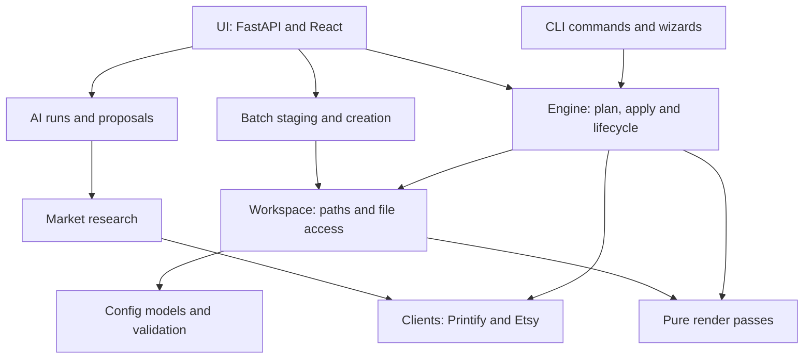
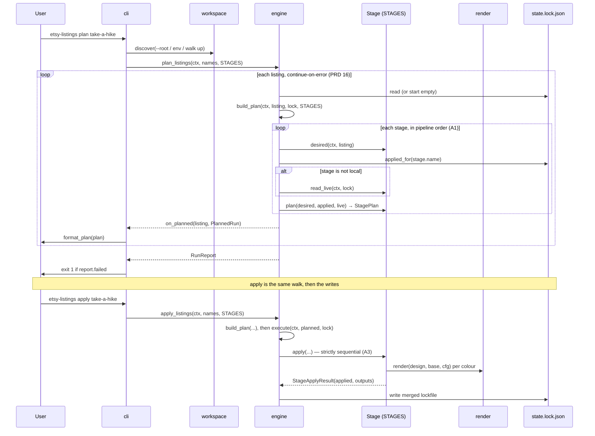
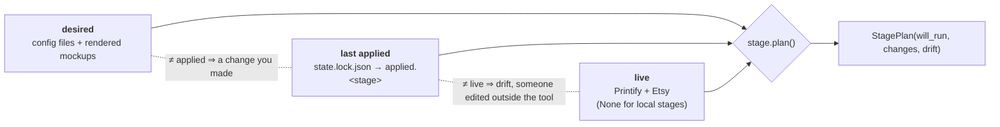
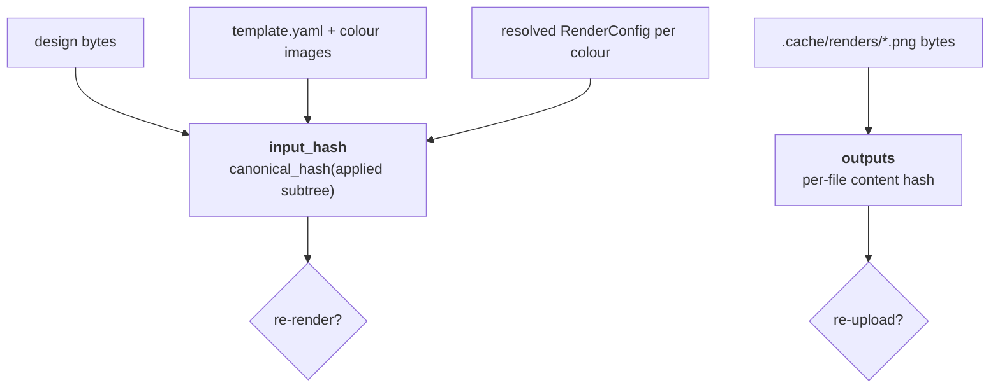
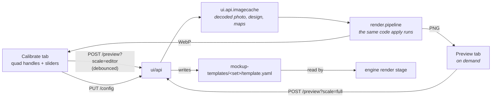

# Architecture

This is the living description of module boundaries, data flow and invariants.
Feature requirements live in the [documentation index](README.md#features);
decision rationale is being extracted into [ADRs](adr/README.md). The
[original PRD and plan](README.md#history) are retained as historical snapshots.

## Module boundaries

```mermaid
graph TD
    CLI[CLI commands and wizards] --> ENGINE[Engine: plan, apply and lifecycle]
    UI[UI: FastAPI and React] --> ENGINE
    UI --> AI[AI runs and proposals]
    AI --> MARKET[Market research]
    UI --> BATCHES[Batch staging and creation]
    ENGINE --> WORKSPACE[Workspace: paths and file access]
    ENGINE --> CLIENTS[Clients: Printify and Etsy]
    ENGINE --> RENDER[Pure render passes]
    MARKET --> CLIENTS
    BATCHES --> WORKSPACE
    WORKSPACE --> CONFIG[Config models and validation]
    WORKSPACE --> RENDER
```

This diagram shows the main flows, rather than every import. Entry points
adapt the engine's domain events and reports; clients own HTTP; the workspace
owns the data tree. Rendering takes arrays and frozen configuration, with file
I/O at its boundary. Each package's `__init__.py` documents its public interface
and what it deliberately withholds.

| Module | Owns | Boundary |
|---|---|---|
| `cli` | Typer commands and terminal presentation | Uses engine reports rather than computing a second diff |
| `newcmd`, `setupcmd`, `authcmd` | Picker and workspace/credential workflows | Prompt sequencing is separate from their testable logic |
| `ui` | HTTP contracts, React presentation, deployment and AI run resources | Adapts engine events; the deploy and AI workers remain separate |
| `engine` | Stage protocol, comparison, lockfile, lifecycle and runs | Stages return values; the engine decides execution and records progress |
| `workspace` | Root discovery, layout, safe paths and file loading | Every caller accesses user data through this boundary |
| `render` | Configuration and pure image passes | No workspace knowledge; callers supply images and geometry |
| `clients` | Typed protocols, transports, Printify catalog/product and Etsy APIs | Shared transport per vendor; separate caller authority through protocols |
| `config` | Validated documents, money, slugs and local listing refusals | No knowledge of where configuration lives on disk |
| `ai` | Provider calls, prompts, validation and cached proposals | Suggestions become deployed content only when accepted into saved fields |
| `market` | Comparable-listing research, scoring and evidence snapshots | Read-only Etsy data informs wording rather than product facts |
| `batches` | Upload validation, staging, name allocation and idempotent local creation | Creates ordinary listings; AI dispatch belongs to the UI server |

`connections.py` builds clients and `RunContext` without resolving credentials
until they are used. `credentials.py` owns credential capture, verification and
storage. `prompts.py` chooses the terminal backend and handles cancellation;
`terminal.py` is a standard-library leaf for encoding and presentation.

Three boundaries carry most of the weight. Only `workspace` knows the data
tree, including how to enumerate it. Only `engine` computes deployment changes
and folds a run's lockfile. Render passes are pure, so input hashes and golden
images describe deterministic work shared by calibration and deployment.

## What `plan` and `apply` actually do

```mermaid
sequenceDiagram
    participant User
    participant CLI as cli
    participant WS as workspace
    participant Engine as engine
    participant Stage as Stage (STAGES)
    participant Render as render
    participant Lock as state.lock.json

    User->>CLI: etsy-listings plan take-a-hike
    CLI->>WS: discover(--root / env / walk up)
    CLI->>Engine: plan_listings(ctx, names, STAGES)

    loop each listing, continue-on-error (PRD 16)
        Engine->>Lock: read (or start empty)
        Engine->>Engine: build_plan(ctx, listing, lock, STAGES)

        loop each stage, in pipeline order (A1)
            Engine->>Stage: desired(ctx, listing)
            Engine->>Lock: applied_for(stage.name)
            alt stage is not local
                Engine->>Stage: read_live(ctx, lock)
            end
            Engine->>Stage: plan(desired, applied, live) → StagePlan
        end

        Engine-->>CLI: on_planned(listing, PlannedRun)
        CLI->>User: format_plan(plan)
    end

    Engine-->>CLI: RunReport
    CLI->>User: exit 1 if report.failed

    Note over User,Lock: apply is the same walk, then the writes
    User->>CLI: etsy-listings apply take-a-hike
    CLI->>Engine: apply_listings(ctx, names, STAGES)
    Engine->>Engine: build_plan(...), then execute(ctx, planned, lock)
    Engine->>Stage: apply(...) — strictly sequential (A3)
    Stage->>Render: render(design, base, cfg) per colour
    Stage-->>Engine: StageApplyResult(applied, outputs)
    Engine->>Lock: write merged lockfile
```

The normal pipeline is `RenderStage`, `PrintifyProductStage`, `PublishStage`,
`EtsyListingStage`, `EtsyMediaStage`, then `EtsyVideosStage`, as exported by
`engine/stages/__init__.py`. Lifecycle handling selects a retract or
retire/resume path when needed. AI proposals are an editor workflow rather
than an engine generation stage.

After each successful stage, execute records the folded lockfile. Later stages
receive newly minted remote ids while still comparing against the previous
run's applied documents. A failure retains progress with an incomplete marker
so the next run can resume. Reviewed UI applies replan and verify the plan
fingerprint before executing; run resources stream progress and allow a
browser to reattach.

## The three-way comparison

Each stage's own `plan()` compares three states using the shared helpers in
`engine/change.py`:

```mermaid
graph LR
    D["<b>desired</b><br/>config files + rendered mockups"] --> Diff{"stage.plan()"}
    A["<b>last applied</b><br/>state.lock.json → applied.&lt;stage&gt;"] --> Diff
    L["<b>live</b><br/>Printify + Etsy<br/>(None for local stages)"] --> Diff
    Diff --> SP["StagePlan(will_run, changes, drift)"]

    D -. "≠ applied ⇒ a change you made" .- A
    A -. "≠ live ⇒ drift, someone edited outside the tool" .- L
```

`read_live()` returning `None` (`stage.local = True`) skips drift entirely, so
no stage has to special-case it. The render stage is local: there is no remote
mockup to drift from.

## Two hashes, doing different jobs

```mermaid
graph TD
    Design["design bytes"] --> IH
    Template["template.yaml + colour images"] --> IH
    Cfg["resolved RenderConfig per colour"] --> IH
    IH["<b>input_hash</b><br/>canonical_hash(applied subtree)"] --> Rerender{"re-render?"}

    Png[".cache/renders/*.png bytes"] --> OH["<b>outputs</b><br/>per-file content hash"]
    OH --> Reupload{"re-upload?"}
```

Collapsing these into one hash breaks the case the PRD calls out: a Pillow or
OpenCV upgrade changes rendered bytes without changing any input, and those
images must re-upload. `applied_at`, `tool_version`, `remote` and absolute
paths never enter a hash; paths that do are workspace-relative and
forward-slashed, so a Windows machine and a Linux runner agree.

## The calibrator

```mermaid
graph LR
    Canvas["Calibrate tab<br/>quad handles + sliders"] -->|"POST /preview?scale=editor<br/>(debounced)"| API["ui/api"]
    Tab["Preview tab<br/><i>on demand</i>"] -->|"POST /preview?scale=full"| API
    API --> Cache["ui.api.imagecache<br/><i>decoded photo, design, maps</i>"]
    Cache --> RenderPipe["render.pipeline<br/><i>the same code apply runs</i>"]
    RenderPipe -->|WebP| Canvas
    RenderPipe -->|PNG| Tab
    Canvas -->|"PUT /config"| API
    API -->|writes| Yaml["mockup-templates/&lt;set&gt;/template.yaml"]
    Yaml -->|read by| Stage["engine render stage"]
```

The preview is the real renderer, not an approximation — that is the whole
point of calibrating in a browser. `template.yaml` is the artefact the
calibrator produces and the render stage consumes; nothing else passes between
them.

"Real renderer" is now structural rather than a claim maintained by hand. Both
routes ask `Workspace.scene_photo()` which photo a scene composites over and
what its derived maps cache under, and both composite through
`render_scene()`. The one thing the preview does differently is where its
geometry comes from — the unsaved boxes under the user's cursor, not the file
on disk — which is exactly the difference that makes it a preview.

### Two sizes, one pipeline

A drag emits a preview request every few frames, and at a real garment photo's
resolution each one re-decoded the mockup PNG and the design PNG from disk,
warped at full size, and PNG-encoded several megabytes — seconds of work per
frame, for an image about to be replaced. So the two things a preview is *for*
were separated:

| | Calibrate tab | Preview tab |
|---|---|---|
| Request | `?scale=editor` | `?scale=full` |
| Base | downscaled to `EDITOR_MAX_EDGE` (900px) | the photo's own size |
| Encoding | WebP, low effort | `encode_png`, as `apply` writes |
| When | debounced, one in flight at a time | on opening the tab, then only on Re-render |

Both run `render_scene()` over the same photo and derived maps. What differs
is how many pixels the server is asked to spend, which is why the fast one is
still honest: it is the output, at a size you can drag against.

The Preview tab renders itself on first sight and then holds still. A config
edit afterwards does not re-run it — a full-size set is minutes of work, and a
nudged box is not a request for it — but it must not silently become a picture
of geometry that has moved on either, so Re-render turns red. The panel stays
mounted behind the canvas rather than unmounting, or flicking between tabs
would throw the renders away and "there is none, so render" would fire on a
set that had just been rendered.

Two consequences worth knowing:

- **Bounding boxes stay in the photo's true pixel space.** `template.yaml`
  stores them there, so the endpoint scales them (and `displace.strength`,
  which is denominated in absolute pixels) onto the smaller canvas, and the
  client is *told* the true size in `TemplateSummary.width`/`height` rather
  than measuring the image it is drawing over. Measuring it would save every
  box a few times too small, with nothing on screen looking wrong.
- **`ui.api.imagecache` memoises what the loop re-reads** — the decoded photo
  at each size, the decoded design, and the derived maps — keyed on path and
  mtime, bounded by total bytes rather than entry count. It sits in `ui`, not
  in `render.io`: the render stage reads each file once per run and needs no
  cache, and giving it one would put mutable process state under the pure
  layer for nobody's benefit.

## Invariants

These are the things that are easy to break by accident and expensive to notice
later. Each traces to a decision.

### Engine and stages

- **Only `engine` computes a diff.** The CLI renderer and the UI serialiser both
  consume `Plan` / `StagePlan` / `Change` objects. Neither may compare states
  itself — that is what makes the CLI and UI enforce identical rules (`A2`, PRD 20).
- **Only `engine` runs a run.** The same rule, one level up: reading a
  listing's lockfile, planning it, executing it, writing the lockfile back and
  carrying on past a failure (PRD 16) all live in `engine/run.py`, behind
  `plan_listings` / `apply_listings`. An entry point supplies the listings and
  formats the resulting `RunReport`; it never opens a lockfile itself.
- **Only the lockfile merges a lockfile.** `Lockfile.fold()` owns the
  replace-versus-merge rules for all four axes, `applied_for()` owns the
  per-stage lookup and `parse_applied_for()` owns the decode. A stage returns
  a `StageApplyResult` and never touches the file; `execute` decides only
  which stages run, in what order.
- **A stage's applied document is a type, not a dict — and the stage does not
  decode it.** The lockfile stores it as JSON; `build_plan` hands `plan()` the
  model the stage declared in `applied_model` (`RenderApplied`,
  `AppliedProduct`). A stage that reads its own document with
  `applied.get("title")` ends up spelling the key names again in every
  function that touches them. Decoding answers `None` for both "never
  applied" and "will not decode", because a document we cannot read is one we
  cannot prove the live state matches. **Every question a stage is asked gets
  it**, `apply()` included. That rule is the lockfile's precisely because it
  was two stages' and they disagreed: one caught `ValidationError` and
  answered `None`, the other indexed the dict and raised `KeyError`, which is
  not a `UserFacingError` and so ended a whole `--all` batch.
- **A refusal is `Blocked`, whichever question produced it.** One vocabulary for
  "this cannot run", reaching the plan two ways because a refusal has two
  moments. A **pre-flight** refusal — no shop configured, copy still a
  sentinel, a design too small — is `desired()` returning `Blocked`, before a
  document exists for a run that was never going to happen. A refusal only the
  live state can prove — a retail price below Printify's cost, which needs
  `variants[].cost` and therefore cannot be known before `read_live` (PRD 40's
  amendment) — is `plan()` returning `Verdict.refused(...)`, which the engine
  turns into the same `StagePlan.blocked`. Neither may raise, and a stage still
  never names itself. What is forbidden is the third shape: a stage that will
  not run reporting a `reason` instead. `format_plan` prints a reason only for
  stages that *do* run, so a listing priced under cost skipped `publish` in
  silence, under a plan reading "No changes."
- **One rule behind that vocabulary, not one per reader.** `config/listing_validation.py`
  owns every local refusal about a listing — predicate, message and all — and
  `engine/stages/gates.py` is the adapter that turns one into a `Blocked` for a
  stage, exactly as `Issue`'s tab and severity turn one into a line in the
  editor's banner. These were once two modules and the garment-profile rule
  diverged: `.strip()` on the engine's side, a bare truth test on the editor's,
  so a `garment_profile: " "` passed `plan` and failed the banner about the same
  file. A new local refusal is a check function there and nothing else.
- **A check reads the workspace through `WorkspaceFacts`, gathered once.**
  `check_listing` is pure and takes no workspace. Build one `WorkspaceFacts`
  where a request begins and hand it down; never load a profile or a template
  config beside a check (each listings-table row used to re-parse the entire
  template catalogue).
- **`will_run` is derived from a reason, never computed beside one.** Two
  expressions of one rule are how a stage comes to run while reporting nothing
  to do.
- **`apply` is strictly sequential.** The current planner also walks stages
  in pipeline order. The original read-only fan-out design (`A3`) is not
  implemented; it is not permission to parallelise writes.
- **`plan` checks two things, not one: would the output differ, and is the
  output still there.** The render cache is gitignored and fully derivable, so
  it is a directory users delete. A stage's `read_live()` is called even when
  `local` is true — `local` means "no *remote* state", so no drift reporting
  and no thread-pool fan-out, not "reads nothing" (`A1`).

### Hashing

- **A hashed document must not depend on the order its inputs happened to
  arrive in.** Sort anything that lands in one. Variant ids reached
  `print_areas[].variant_ids` in the order a listing wrote `colors:`, so
  reordering that list changed `input_hash` and re-applied a product nothing
  about which had changed.
- **Nothing volatile enters a hash.** No timestamps, no absolute paths, no model
  output, no `tool_version`. Only the lockfile's `applied` subtree is hashed, via
  the single `canonical_hash()` helper. Violating this makes every run show a
  spurious diff.
- **Paths inside hashed content are workspace-relative and forward-slashed.**
  Non-negotiable on Windows, where the same content would otherwise hash
  differently than on Linux.
- **Two hash axes, not one.** `input_hash` decides whether to re-render;
  `outputs` (per-file) decides whether to re-upload. Collapsing them breaks the
  library-upgrade case the PRD calls out.

### Rendering

- **Render passes are pure.** No I/O, no globals, no clock. Inputs are ndarrays
  and frozen config. This is what makes both the hash and the goldens meaningful
  (`A7`).
- **Every `cv2` call passes explicit `interpolation` and `borderMode`.** Relying
  on defaults makes output depend on the library version.
- **Rendering is driven purely by `media`.** A scene renders only if some
  `media` entry references it — `listing.colors` drives which Printify
  variants sell, not which photos get rendered (PRD 31).
- **A template is exactly one of three kinds — never a mix.** `kind:
  colour-matrix | multiple | single`, a discriminated union (`A11`). **No
  garment-profile-level registry of listing templates** — a template lives
  purely in `mockup-templates/{name}/`, and any listing may reference any of
  them. A listing's `media:` always names `{template, colour?}` explicitly —
  there is no default template and no bare-colour shorthand (`A13`, PRD 29).
  `GarmentProfile.preview_template` is the one exception: a single
  `colour-matrix` template the editor uses to judge colours, not a `media:`
  default.
- **`colour-matrix`-kind mockup filename = slugified Printify colour name.**
  Convention, not a mapping table. A sparse `exceptions.yaml` handles what
  will not slugify (PRD 7a). When nothing matches exactly, `template_base_image`
  falls back to a filename ending in the slug's hyphen segments — but only if
  exactly one photo in the directory qualifies; two candidates is refused, not
  guessed at. That fallback is lookup-only: `template_colours` still reports
  a non-matching filename as its own name, since deriving a colour from an
  unknown shared prefix (enumeration) isn't the same question as matching a
  known slug against one (lookup). `multiple`- and `single`-kind templates use a
  fixed `scene.png` instead (PRD 28). **The browser is never told this rule**;
  it is served the answer. `TemplateSummary.photos` carries each scene's real
  workspace-relative path, resolved through `Workspace.scene_photo`, because the
  editor's caption used to compose one from the convention and so named a
  missing file for exactly the pack the fallback exists for.

### Workspace, credentials and prompts

- **Only `workspace` knows the directory layout — including how to *list* one.**
  Everything else asks for `workspace.lock_file(name)` rather than joining
  `listings/<name>/state.lock.json`, and for `workspace.template_photos(name)`
  rather than globbing `mockup-templates/<name>/*.png`. Two rules enforce it:
  `resolve()` rejects paths escaping the root (`A8`), and the layout accessors
  reject any name that is not a single path segment. Together they keep the UI's
  endpoints safe — template names arrive from URLs — so this is a security
  boundary, not a tidiness rule. A new path-taking CLI option or endpoint goes
  through them, and so does a new `glob`.
- **A client is built through `connections.py`.** Which credential is resolved
  when, what a missing one means, and where the Etsy token file lives are one
  set of answers, not four (`cli`, `setup`, `auth` and the e2e layer each used to
  assemble the Etsy client themselves). The rule the module exists to hold: **a
  credential is resolved when it is used, never when a client is built**, so a
  workspace that has only ever rendered mockups can still `plan`.
- **A credential is captured, verified and stored through `credentials.py`.**
  Where it already lives (environment, then the workspace `.env`), what to say
  before asking, how to ask, how to prove it, and what to say when it fails.
  Capturing stays separate from storing because `auth` writes per credential as
  it goes while `setup` writes once every question is answered.
- **Secrets never enter the repo.** Tokens in `.auth/`, keys in `.env`, both
  gitignored, and both in the *workspace*, not the repo. `config/secrets.py` is
  the only reader; a missing credential is reported by name and file, never as a
  raw `401` traceback.
- **A cancelled prompt raises; it is never a `None` a caller might miss.**
  `prompts.choose`/`text`/`confirm` answer `None` because that is the honest
  shape for a backend, but no wizard uses them directly — `pick`, `ask_choice`,
  `ask_text` and `ask_confirm` raise `prompts.Cancelled`, caught once in
  `cli/app.py`. A missed `None` here writes a `None` to a file.
- **Every price carries an explicit currency.** Bare numbers are rejected at
  validation. Revenue is NOK, Printify's costs are USD; a bare number is a bug
  waiting to be a refund (PRD 24).

## Testing layers

| Layer | Answers |
|---|---|
| Unit | Does this function obey its contract? (`Money`, slugs, hashing, path safety) |
| Golden | Did the pixels change, and which pass changed them? |
| Behaviour | Does plan/apply do the right thing over time? (idempotency, re-render on change) |
| Browser | Do the React app, the API and the renderer work together? |
| Contract | Does the wire payload match what the API expects? |
| E2E | Does it work against the real Printify and Etsy? |

Reach for a fake to test behaviour and a cassette to test payload shape. The
browser layer exists because nothing below it can catch a wiring mistake
between three otherwise-tested pieces.
