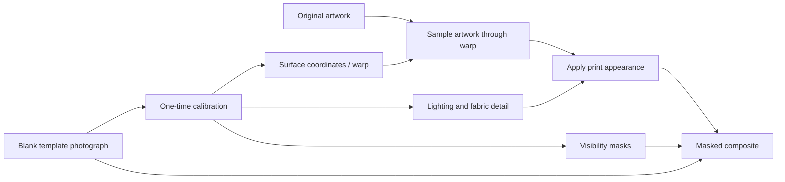

# Making T-shirt mockups follow the fabric

Research date: **2026-10-01**, repository baseline **`62190c7`**. This is a research report and a proposed experiment sequence, not an amendment to the PRD or an implementation spec. It combines inspection of the current renderer, small numerical probes of that renderer, and primary-source research. Recommendations and predicted benefits are identified as engineering judgments; no improved render of a real template has been produced or evaluated yet.

**User constraint:** the user has no Photoshop licence. The recommended workflow must support authoring calibration and rendering without Photoshop; Photoshop-authored reference PSDs are not a prerequisite.

## Recommendation

The most promising approach for this project is to **calibrate a reusable surface mapping for each photographic template, then transfer lighting and fabric detail separately**. Keep the original design as the image being sampled. A small editable control mesh can handle chest curvature and broad folds; an optional two-component displacement field can add finer wrinkles. Garment and foreground masks handle visibility. These assets are authored once and reused for every design rendered on that template.

Start the experiments with lighting, because the current default has a particularly consequential limitation: **soft-light cannot put shadows onto fully white ink**. Then compare a mesh against the existing four-corner placement. Improving just one of those will leave the other source of the pasted-on appearance intact.

This is a good fit for a finite library of templates and a deterministic local renderer. Learned UV prediction is worth testing as a way to initialize template calibration. Full 3D becomes more attractive if the project starts creating its own scenes or needs changing camera angles. Generative garment editing is a poor fit for faithfully reproducing a specific printed design.

The follow-up investigation below identifies concrete reusable implementations. **Start with a custom mesh/TPS calibrator using existing OpenCV and optionally scikit-image; evaluate GEGL for brush-based fold corrections.** PhotoshopAPI can construct warps without Photoshop, but supplies no equivalent visual calibration interface by itself. It remains an optional engine comparison or PSD-import candidate. These are integration priorities, not claims of measured image quality or verified compatibility.

## What the reference image establishes

The supplied screenshot shows muted pink line art on a dark, washed shirt. The impression of integration comes from several cues together: print brightness varies over the shirt, fabric detail remains visible, and the artwork appears to change shape across the draped chest. Sparse line art also leaves much of the actual shirt exposed, making this an easier visual case than a large opaque white graphic.

Those are observations of the screenshot, not proof of how the seller made it. The image could be a photograph, a carefully authored composite, or another process. Its resolution also limits what can be concluded about subtle deformation. It is a useful aesthetic reference, but an experiment needs the same blank photograph and artwork across candidates to identify which technique helped.

## What the current code actually does

The public entry point is [`render_scene`](../src/etsy_listings/render/pipeline.py). All template kinds use the same sequence. [`passes.py`](../src/etsy_listings/render/passes.py), [`maps.py`](../src/etsy_listings/render/maps.py), and [`config.py`](../src/etsy_listings/render/config.py) establish the following facts.

| Component | Current behavior | Consequence for realism |
| --- | --- | --- |
| Main geometry | One homography from the design rectangle to four corners | Can express perspective, but cannot bend an interior line around a curved chest or locally compress it at a fold. |
| Wrinkle geometry | Gaussian-blurred grayscale, normalized using the entire photograph; Sobel gradients become sampling offsets | A brightness-based heuristic. Fabric dye, wash, illumination and background can influence the supposed geometry. |
| Displacement magnitude | `24 * strength * Sobel(height)` | The constant is a multiplier, not a bound on displacement. Broad gentle changes can produce extremely small motion; sharp gradients can produce substantially more. |
| Lighting | Whole-photo min/max-normalized grayscale, blended into the design | Background brightness affects the garment's shading values. Dark fabric color is not separated from dark illumination. |
| Default blend | Soft-light, opacity 0.6 | White and black design channels stay fixed at their endpoints; white line art can remain completely unshaded. |
| Visibility | Artwork alpha, without garment/foreground masks | Nothing can restore a foreground necklace, hand, collar or overlapping fabric above the print. |
| Sampling and composite | Straight-alpha uint8 RGBA in warp/displace, followed by sRGB arithmetic | Repeated resampling and transparent-edge colors can affect fine lines. These are finishing problems, separate from missing surface geometry. |

### Three numerical probes

These probes ran against this worktree's functions, using the existing main checkout's Python environment and OpenCV 4.10.0. They used synthetic arrays, not real garment photographs. No dependencies or renderer settings were changed.

With the default `ShadeConfig`, one opaque white pixel, one mid-gray pixel and one black pixel produced these channel values:

| Shading-map value | White input 255 | Gray input 128 | Black input 0 |
| --- | --- | --- | --- |
| 0.00 | 255 | 90 | 0 |
| 0.25 | 255 | 109 | 0 |
| 0.50 | 255 | 128 | 0 |
| 0.75 | 255 | 144 | 0 |
| 1.00 | 255 | 160 | 0 |

This is also apparent algebraically in `_soft_light`: its dark branch reduces to 1 for white and 0 for black, and the bright branch does the same. Increasing the shading opacity cannot fix it. Near-white channels have correspondingly limited shadow response. This is a property of the blend, not an argument that every white print currently looks wrong.

A synthetic dark shirt with gray values **30, 45 and 60**, surrounded by a white **255** background, produced garment shading values **0.0000, 0.0667 and 0.1333**. A single scene-wide range therefore places all three shirt samples on the dark side of the neutral 0.5 blend value. Garment-relative normalization would give a different answer; merely cropping a background can change the current answer.

Finally, a height field increasing smoothly from 0 to 1 across a width of **1200 pixels** produced approximately **0.16013 pixels** of horizontal displacement at strength 1. At **3600 pixels**, the equivalent ramp produced **0.05335 pixels**. In the interior, this follows from the unnormalized 3x3 Sobel response, `8 / (width - 1)`, multiplied by 24. This demonstrates why a larger displacement slider value is not a general solution for broad contour following.

The editor additionally derives maps from a resized photograph with the same 15-pixel blur kernel and scales displacement strength with canvas size; see [`templates._scaled`](../src/etsy_listings/ui/api/templates.py) and [`PreviewImages`](../src/etsy_listings/ui/api/imagecache.py). Full-size and editor-size maps can therefore describe different wrinkle scales. That is a code-derived concern to measure, not a demonstrated failure on a particular template.

### Photoshop displacement is a useful comparison, but a different operation

Adobe documents Displace as interpreting map channel values directly: middle gray means no motion, darker/lighter values specify negative/positive motion. A single channel drives motion along one fixed diagonal; two channels can control horizontal and vertical motion separately. The current code instead differentiates one scalar brightness field. Both can be useful artistic effects, but they are not equivalent implementations. [Adobe's Displace documentation](https://helpx.adobe.com/uk/photoshop/using/applying-specific-filters.html).

Adobe's own shirt tutorial also combines displacement with image-specific blur, blend and opacity tuning. That supports using it as a baseline experiment, rather than assuming any one brightness recipe reconstructs the fabric. [Adobe's T-shirt displacement workflow](https://www.adobe.com/products/photoshop/displacement-map.html).

## Why shape, shading and texture need separate controls

A surface mapping answers **which point in the artwork is visible at this photograph pixel**. Shading answers **how that point is lit**. Material response answers **how printed ink differs from unprinted fabric**. Visibility answers **whether something is in front of it**. A dark crease contains evidence for several of those questions, but does not uniquely answer any of them.

Intrinsic-image research describes the separation of observed appearance into reflectance and shading. It provides a better conceptual basis for lighting transfer than treating dark cloth as weak illumination. The separation is inferred from assumptions and priors, not directly measured by grayscale conversion. [Intrinsic Images in the Wild](https://www.cs.cornell.edu/~sbell/pdf/siggraph2014-intrinsic.pdf).

For this project, a useful proposed representation is:



The separation is a proposed design, not an existing repository interface. An authored 2D mapping is sufficient for a fixed viewpoint: the renderer does not have to reconstruct the whole person or garment in 3D just to sample the visible chest correctly.

## Approaches to contour following

These rankings are engineering judgments for this repository's fixed photographic templates. They are not measured quality or timing results.

| Approach | What it contributes | Preparation / integration effort | Assessment |
| --- | --- | --- | --- |
| Existing quad plus better lighting | Perspective and stronger visual integration | Low | Useful first comparison; cannot supply curved interior geometry. |
| Authored control mesh / UV map | Broad drape, local compression and curved print lines | Medium | Best first geometry candidate for a reusable template library. |
| TPS or MLS | Smooth interpolation of authored landmarks | Medium | Compare if a simple mesh looks angular or is awkward to calibrate. |
| 2D ARAP | Shape-preserving handle editing | Medium to high | An authoring aid; excessive rigidity can suppress real foreshortening. |
| Authored X/Y displacement | Directional local wrinkle corrections | Medium | Useful refinement after broad geometry is right. |
| Learned normal-guided UV | Estimated dense coordinates from a photograph | High | Promising calibration initializer; review and repair are necessary. |
| Pattern-assisted capture | Correspondences observed on a specially patterned garment | High; requires new capture | Attractive for an owned template-production workflow. |
| 3D garment and UV | Known surface, visibility and controllable viewpoints | High | Strong for newly created scenes; fitting existing photos is expensive. |
| Generative fabric retexturing | Synthesized material appearance | High; fidelity validation unresolved | Published task differs from exact graphic placement. |

### Authored mesh and dense UV mapping

OpenCV's remapping operation consumes independent source X/Y coordinates for each destination pixel. It supplies the sampler, not the surface estimate. A two-channel map can therefore encode the visible shirt's coordinates without requiring a reconstructed 3D garment. [OpenCV 4.10 geometric transformations](https://docs.opencv.org/4.10.0/da/d54/group__imgproc__transform.html).

For a prototype, initialize approximately 16–25 control points from the existing quad. Move interior points so rows and columns describe the observed drape. Rasterize destination triangles with barycentric interpolation into a photo-to-print lookup. Keep the print-space rectangle canonical: replacing artwork should reuse geometry rather than require recalibration. Add constraints around an important fold where necessary, and reject crossed or nearly collapsed triangles.

This is a proposed authoring workflow. It does not make the manually estimated mapping ground truth. A coarse triangular mesh is continuous across shared edges but its derivatives can change abruptly, potentially producing visible kinks. Smooth interpolation or local refinement may be needed. A broad cylindrical chest warp could be an optional initialization for a rounded torso, but its assumed shape will not account for asymmetric drape or local folds; compare it against the actual grid, rather than treating it as a recovered body surface.

An overlapping fold is a more fundamental limitation. A globally smooth map cannot describe a discontinuous jump to a different visible surface patch. Use separate patches or a visibility-aware UV map when material is hidden. Foreground masking alone restores an arm above the print; it does not discover the correct material coordinates on two sides of a folded-over shirt.

### TPS, MLS and ARAP: better interpolation and editing

Bookstein's thin-plate spline formulation provides smooth landmark-based deformation with affine and non-affine components. SciPy offers a TPS kernel through `RBFInterpolator`, including smoothing and polynomial terms. [Principal Warps, 1989](https://user.engineering.uiowa.edu/~aip/papers/bookstein-89.pdf), [SciPy's RBFInterpolator](https://docs.scipy.org/doc/scipy/reference/generated/scipy.interpolate.RBFInterpolator.html).

TPS is a sensible comparison if triangle interpolation looks angular. Use exactly the same control landmarks to compare it fairly. It can overshoot or create extreme local distortion, so evaluate local stretch and map validity. More mathematical smoothness does not establish more correct fabric geometry. A new SciPy dependency is not required to make the first mesh experiment useful.

Moving least squares offers affine, similarity and rigid point/line-handle image deformations. ARAP instead optimizes deviation from local rigidity under constraints; libigl documents a reference implementation. [MLS, 2006](https://people.engr.tamu.edu/schaefer/research/mls.pdf), [ARAP, 2007](https://igl.ethz.ch/projects/ARAP/arap_web.pdf), [libigl tutorial](https://libigl.github.io/tutorial/#as-rigid-as-possible).

These can make calibration handles easier to use. However, nearly inextensible cloth can become strongly compressed in the image when it turns away from the camera. A strong **2D** rigidity preference can resist exactly that wanted foreshortening. Try similarity MLS before taking on an iterative ARAP solver, and preserve permission to compress around folds. This assessment follows from the difference between material-space rigidity and image-plane shape, not from a garment-specific benchmark of these solvers.

### Directional wrinkle displacement

Use two fields, `dx` and `dy`, if a calibration needs horizontal and vertical corrections independently. A grayscale-derived gradient can remain an inexpensive optional initial guess, but should not be described as measured depth. Paint or constrain corrections where the photograph's illumination gives an ambiguous answer. Limit motion near print boundaries and seams when the heuristic is being attracted to them incorrectly.

Document whether a field describes forward movement or inverse sampling, its units, and its reference dimensions. Negating a spatially varying forward field is generally not its inverse. When combining an image-space wrinkle correction with the main inverse mapping, compose the coordinate transforms in the specified order before sampling the design; simply adding offsets in different coordinate systems is incorrect.

Calibrate all blur lengths and displacement magnitudes relative to a reference canvas or print width. For editor previews, derive the full-resolution fields once, then resize them with the correct coordinate scaling. Verify the result against a downsampled final render. This proposal addresses resolution consistency; it does not imply that the existing fixed 24-pixel factor should simply be increased.

### Learned UV estimation from existing photographs

**Normal-guided Garment UV Prediction (CVPR 2023)** estimates garment texture coordinates from predicted normals and surface-isometry constraints without full 3D reconstruction. The paper explicitly reports problems at self-occluding folds and with shading estimates contaminated by strong patterns. Its texture pipeline treats shading separately from UV. [Author project](https://www.yasamin.page/normal-guided-uv), [original paper and limitations](https://arxiv.org/pdf/2303.06504).

This is closely aligned with the geometry problem and deserves a later calibration experiment. Export an approved map and reuse it locally. Do not assume the predicted normals are accurate, the shirt falls within the training distribution, or the continuous map handles a hidden fold. Evaluate model availability, implementation dependencies and model/code licensing before estimating integration effort. No such model was installed or run for this report.

## AI-assisted map generation without Photoshop

**Yes, learned models can help initialize a template's geometry.** The difficult task is estimating where cloth coordinates belong in the photograph, rather than creating the mesh's triangles. An AI-assisted proposal can reduce manual calibration, provided it is reviewed and stored as a fixed asset. This is an engineering recommendation, not a demonstrated reduction in authoring time.

Distinguish three outputs:

- **Depth:** distance along the camera's viewing geometry; useful evidence about broad shape.
- **Surface normals:** the direction the fabric faces at each pixel; potentially useful for turns and folds.
- **UV coordinates:** the material-space location corresponding to each visible image pixel; the closest match to what our artwork sampler needs.

A depth or normal image is not a finished artwork displacement map. Converting geometry into material coordinates needs a solver and constraints, including print origin, orientation and scale. Even accurate visible geometry does not uniquely identify the cloth's original flat parameterization. Simply differentiating predicted depth and feeding it into the current displacement pass does not establish correct chest foreshortening.

### Available models to test

| Candidate | Actual output | Practical role in our experiment |
| --- | --- | --- |
| [Marigold Normals v1.1](https://huggingface.co/prs-eth/marigold-normals-v1-1) | Camera-space surface normals from one image | Accessible diffusion-based geometry initializer, with published weights and a demo. |
| [Lotus normals](https://github.com/EnVision-Research/Lotus) | Surface normals; related checkpoints predict depth | Second model to compare on the same photographs. |
| [Depth Anything 3](https://github.com/ByteDance-Seed/Depth-Anything-3) | Depth, confidence and camera estimates | Broad-shape baseline; does not directly output cloth UV. |
| [Normal-guided Garment UV Prediction](https://www.yasamin.page/normal-guided-uv) | Garment UV from predicted normals and surface constraints | Closest algorithmic reference to a reviewed 2D template mapping. |
| [DMap, SIGGRAPH 2025](https://github.com/liren2515/DMap) | Image/pattern/3D correspondences and reconstructed garment | More complete generative reconstruction route, with significant input and dependency constraints. |

The table's proposed roles are our assessment. None of these was run against the user's templates.

**Marigold** is specifically a diffusion-based normals estimator, with an official [interactive demo](https://huggingface.co/spaces/prs-eth/marigold-normals) and a Diffusers pipeline. Its model card specifies screen-space unit vectors, approximately 768-pixel effective processing resolution, and optional uncertainty from ensembles. Increasing output size does not establish recovery of finer folds. The code is Apache-2.0, while the checkpoint uses **OpenRAIL++-M**, so those are separate licence findings. Its repository recommends WSL2 for Windows; native operation in our Cygwin-driven environment has not been verified. [Model card](https://huggingface.co/prs-eth/marigold-normals-v1-1), [implementation and setup](https://github.com/prs-eth/Marigold), [model licence](https://raw.githubusercontent.com/prs-eth/Marigold/main/LICENSE-MODEL.txt).

**Lotus v1** also publishes diffusion-based normal checkpoints, inference code and a [normal demo](https://huggingface.co/spaces/haodongli/Lotus_Normal). The official `lotus-normal-g-v1-1` checkpoint is labelled Apache-2.0; compare its predictions rather than assuming a generic benchmark ranking transfers to dark washed shirts. [Implementation](https://github.com/EnVision-Research/Lotus), [checkpoint](https://huggingface.co/jingheya/lotus-normal-g-v1-1).

**Lotus-2** is a newer generative-prior geometry estimator with public code, weights and demos. Its current setup asks for at least **40 GB GPU memory** and access to **FLUX.1-dev**. That makes the hosted demo a more practical initial comparison than assuming a modest local GPU can run the documented setup. Its underlying model's terms also need separate evaluation. Newer does not automatically mean the best first integration for this project. [Official setup](https://github.com/EnVision-Research/Lotus-2).

**Depth Anything 3** exposes float depth, confidence and camera matrices through its Python API. Its released checkpoint licences differ: DA3-Base/Small and the listed monocular models use Apache-2.0; large/giant any-view and nested checkpoints are listed as CC BY-NC 4.0. A coloured depth preview is not a quantitative UV map. Use raw arrays and preserve depth/camera conventions if evaluating geometry reconstruction. [Official API and model table](https://github.com/ByteDance-Seed/Depth-Anything-3).

For **Normal-guided Garment UV Prediction**, the inspected author project page provides the paper and visual results, but no public implementation/checkpoint download was found there. That is a limited availability finding, not proof that no implementation exists anywhere. It remains an algorithm reference rather than a verified installable dependency.

### DMap: a direct generative route with important fit limits

DMap combines a mapping network and a diffusion prior over garment pattern coordinates. Its paper establishes image-pixel, UV and 3D correspondences, rather than merely generating a visually plausible print. However, its stated limitations include **full-body input requirements**, inability to handle partial garments or profile views, small wrinkles and multilayer structures. This is therefore not a demonstrated ready-made solution for cropped marketplace photos or flat lays. [Original paper and limitations](https://arxiv.org/html/2504.08353v2#S6.SS0.1).

The official own-data workflow requires accurate garment masks, predicted Sapiens normals, estimated SMPL body parameters and aligned cameras. Its mapping script writes numerical `uv_transfer_*.npz` data, making a coordinate-export experiment technically plausible. That needs testing to establish correspondence conventions and print placement. The script also contains unconditional CUDA calls, despite initially selecting a CPU fallback; CPU execution should not be promised. [Input preparation](https://github.com/liren2515/DMap/blob/main/docs/DATA_PREPARE.md), [mapping script](https://github.com/liren2515/DMap/blob/main/scripts/step2_uv_mapping_FB.py).

The repository links checkpoints and specifies a substantial Linux/CUDA environment with PyMesh/PyTorch3D. No explicit top-level DMap code/checkpoint licence was located in the inspected root and documentation. Its recommended Sapiens dependency uses **CC BY-NC 4.0**; body model assets have their own terms. These findings prevent treating the documented pipeline as a cleared commercial dependency. The publication's licence does not establish permission for implementation code or weights. [Installation](https://github.com/liren2515/DMap/blob/main/docs/INSTALL.md), [environment](https://github.com/liren2515/DMap/blob/main/environment.yml), [Sapiens licence](https://github.com/facebookresearch/sapiens/blob/main/LICENSE).

A [2026 spatio-temporal extension](https://github.com/kasvii/DMap) also publishes a normal-to-UV/depth stage followed by garment completion and refinement. It is worth tracking if videos or complete worn-garment reconstruction become relevant; it does not remove the need to evaluate input suitability and licences.

### A bounded experiment sequence

1. Compare Marigold and Lotus normals on a gently draped, a broadly curved and a heavily folded template, including dark washed fabric. Evaluate a depth model as a separate broad-shape baseline. Inspect whether the inferred geometry resolves the folds before building a mapping solver.
2. Mask the print region and retain the existing placement quad as origin/orientation/scale constraints. Fit a smooth reviewed surface mapping from the predicted geometry, using additional anchors where needed. This conversion is custom work, not a built-in Marigold/Lotus feature; Normal-guided UV is an algorithmic reference.
3. Display a diagnostic grid and circles through the proposed mapping. Allow manual corrections and split visible patches at occluding folds. Check orientation, collapse, excessive stretch and disagreement between models.
4. Save the approved float coordinate map. Generate all production artwork through the pinned local sampler, with independent lighting and visibility passes. Model inference stays in optional calibration tooling.
5. Measure whether the draft actually reduces calibration time and improves geometry compared with the same mesh initialized from the quad. A pleasing normal-map preview alone is not acceptance evidence.

An additional speculative route is to ask an image-editing model to place a labelled regular grid on the shirt, detect its correspondences, and fit a constrained map. This is **an untested experiment**, not a known reliable exporter: the model can change the shirt's silhouette, invent folds, omit labels or merge grid lines. It would require strict registration and topology checks before any coordinates were accepted. Prefer models that output numerical geometry for the first comparison.

No Photoshop licence is needed for these candidate AI workflows. Inference hardware, implementation access and checkpoint licences remain separate practical questions. No images were uploaded to external demos, models downloaded or templates modified during this research.

### ChatGPT prompting as a calibration experiment

The user's preferred experiment is to use ChatGPT's image capabilities to propose the calibration directly. **This is worth testing**, and could avoid adopting a specialist reconstruction stack if a small reviewed map is adequate. There is no verified success result for garment displacement-map generation in this investigation; the following are proposed experiments.

OpenAI's official image prompting guidance recommends explicit edit targets, preservation constraints and inspecting each result. Its image-generation documentation still identifies precise placement and layout control as limitations. Vision documentation also flags precise spatial localization and image resizing. Those limitations matter for numerical geometry even when an output looks photorealistic. [Image prompting](https://developers.openai.com/api/docs/guides/image-prompting), [image-generation limitations](https://developers.openai.com/api/docs/guides/image-generation#limitations), [vision limitations](https://developers.openai.com/api/docs/guides/images-vision#limitations).

**Experiment A: generate visible correspondences, then calculate the map.** Supply the original blank photograph and an independently generated flat grid with uniquely identified intersections. Ask the image editor to show the grid printed on the existing cloth, following its drape. Recover the generated grid's node locations, align the output to the original photograph, manually inspect questionable nodes, and fit a constrained inverse mapping. Use our code to generate the final float arrays, rather than trusting generated image colours to encode exact numbers.

Suggested starting prompt, authored for this experiment:

> Image 1 is the blank T-shirt photograph. Image 2 is a flat calibration grid with uniquely identified intersections. Edit image 1 to show image 2 printed within the marked chest region. Preserve the photograph's crop, camera angle, shirt silhouette, existing folds, seams, person, background and lighting. Let the grid curve and compress as fabric turns away from the camera. Preserve the grid's connectivity, ordering and intersection IDs; do not add, remove or duplicate them. A genuinely hidden part may disappear behind a fold. Keep the lines and IDs clear enough to inspect. Produce the edited photograph without annotations outside the grid.

Begin with a small grid, for example 5×5 nodes, and an unoccluded print region. Supply the actual grid image rather than relying on the model to invent a consistent one. Preservation and topology instructions are requests, not guarantees. Do not correct a missing grid point by assuming where its label should have been; inspect it or reject that proposal. Occluding folds require multiple visible patches rather than forcing one continuous field.

**Experiment B: image analysis produces sparse numerical controls.** Give the model the blank photo, existing placement quad, and fixed control-point IDs with their canonical print coordinates. Ask for destination node positions as normalized image coordinates, plus visible/uncertain flags and short fold explanations. Plot those controls over the original photo for review before interpolation. This avoids using an edited shirt as the coordinate frame, but does not remove guessed geometry or localization error.

If automated via the OpenAI API, Structured Outputs can enforce the object schema and field types. It does **not** establish that coordinate values are correct; the documentation explicitly says structured answers can still contain mistakes. A manual ChatGPT JSON request is also distinct from an API-enforced schema. [Structured Outputs](https://developers.openai.com/api/docs/guides/structured-outputs).

**Experiment C: directly generate an encoded displacement image.** This most closely matches the user's initial idea, but needs a defined data contract. For a proposed inverse correction in photograph coordinates, one test encoding is:

```text
R = 128 + 127 * dx / D
G = 128 + 127 * dy / D
B = 128
dx, dy in [-D, D], with D specified in reference-image pixels
neutral = (128, 128, 128)
positive dx/dy means sample to the right/down
```

Here `p + (dx,dy)` is passed through the base photo-to-print mapping before sampling artwork. This is a specific inverse-sampling convention, not forward movement of an artwork point. Keep the print-validity mask separate and request neutral values outside it. Prevent rescaling or account for it explicitly; treat channels as data rather than applying colour correction. Quantization and interpolation affect the decoded field.

A generated grayscale wrinkle picture, depth visualization or RGB image that merely resembles a displacement map does not satisfy that contract. A prompt may produce plausible folds while violating neutral values, signs, range or registration. Test neutral areas and decode known offsets before evaluating the artwork. This direct route is worth comparing, but the correspondence/grid route is easier to inspect and mathematically constrain.

**The acceptance test is a fresh local render on the original photograph.** Apply the recovered map to a different grid, circles and fine text using independent lighting. Compare it to the original quad and a manually corrected mesh. Check crop/registration, unique IDs, triangle orientation, near-zero area and excessive local stretch. A pleasing AI-edited grid image cannot establish that the extracted field will work on other artwork. Self-reported confidence is a review cue, not a calibrated error estimate.

Use AI only when creating or revising the template asset. Save the approved numeric map and reuse it for all designs. This workflow requires no Photoshop, and prevents future image-generation variation from entering every listing render. The existing grayscale-gradient pass cannot consume these two-channel fields directly; a deliberate renderer/configuration change would be required if the experiment succeeds.

## Other geometry workflows

### Pattern-assisted template capture

**Pattern Guided UV Recovery (2024)** reconstructs UV, shading and masks from single-camera video of garments made with a special color-coded pattern. Its 15 mm grid is designed to be visible to a phone camera, and its mapping handles discontinuities near folds and occlusion boundaries. [Original paper](https://arxiv.org/html/2407.10137v1).

The lesson for a new photography workflow is substantial: observe where known points on the cloth ended up, instead of estimating everything from a blank shirt's brightness. This cannot directly recover correspondences from an existing purchased blank photograph. A separate patterned and blank capture is also difficult to align if changing shirts changes their folds. The paper's own workflow replaces the pattern appearance, rather than guaranteeing a matching independent blank capture.

For this project, consider pattern-assisted capture if high-quality templates become a product asset worth producing in-house. It is a different undertaking from improving the current local compositor. Its code, trained components and resulting material appearance would need their own evaluation before commercial adoption.

### Full 3D and a hybrid alternative

Blender documents cloth simulation with mesh geometry, materials and UV assignment. That gives a route to known coordinates and controllable scenes. [Blender's cloth workflow](https://docs.blender.org/manual/en/2.80/physics/cloth/introduction.html).

A photographed blank does not come with a matching mesh, camera, lighting setup or material. Recovering all of those, including small wrinkles, is likely a much larger task than calibrating a visible chest patch. Full 3D is therefore a better candidate for new owned scenes, changing angles, or an existing garment model than for the first improvement to a fixed library of photos.

A hybrid is possible: fit or sculpt only the relevant surface, project its UV mapping through the matching camera, and export fixed photo-space coordinate maps. Continue using the original photograph and the local compositor at runtime. This is a proposed workflow that preserves the surrounding photographic detail and amortizes 3D authoring work over many designs.

### Graphics-editor workflows as a quality benchmark

Photoshop provides control-mesh warping, and Smart Object content replacement can retain previously authored transformations. Illustrator's Mockup feature applies vector artwork to custom raster photos and auto-adjusts it to object geometry. [Photoshop Warp](https://helpx.adobe.com/photoshop/desktop/effects-filters/artistic-stylize-filters/reshape-and-distort-images-with-transform-warp.html), [Smart Object replacement](https://helpx.adobe.com/ca/photoshop/desktop/create-manage-layers/smart-objects/replace-the-contents-of-a-smart-object.html), [Illustrator Mockup](https://helpx.adobe.com/illustrator/desktop/manage-objects/traces-mockups-symbols/create-mockups-for-images.html).

An already available Photoshop reference could be an optional visual target, but authoring one is excluded by the user's licence constraint. Use GIMP for an accessible visual comparison instead. Illustrator's automatic result is additional background research, not a required workflow. Neither Adobe feature's documentation establishes a headless local renderer or an export of the complete mapping in a form this project can directly consume. Illustrator's cited workflow also starts with vectors; tracing a raster design just to fit it would introduce a separate fidelity question.

Buying a PSD may buy skilled calibration, masks and appearance layers, but does not automatically buy a Python-compatible render pipeline. In particular, psd-tools lists Smart Object editing and adjustment-layer composition among unsupported features. Asset extraction and full Photoshop behavior are different capabilities. Verify a specific template before relying on a PSD import path. [psd-tools supported features](https://psd-tools.readthedocs.io/en/latest/).

That limitation is specific to the importer. The independent PhotoshopAPI library offers a materially more relevant Smart Object implementation, investigated below.

### Recent generative retexturing

**FabricTryOn (SIGGRAPH 2026)** uses material removal and application through image-editing diffusion models to transfer swatch appearance to garments. Its stated goals include geometry, illumination, pattern density and woven structure. **Refaçade (December 2025)** transfers reference texture to image/video objects and intentionally disrupts the reference's global layout by permuting patches. **TexGarment (CVPR 2025)** generates UV textures using text prompts and garment structure. [FabricTryOn project](https://style3d.github.io/fabric_tryon/), [Refaçade paper](https://arxiv.org/abs/2512.04534), [TexGarment paper](https://openaccess.thecvf.com/content/CVPR2025/papers/Liu_TexGarment_Consistent_Garment_UV_Texture_Generation_via_Efficient_3D_Structure-Guided_CVPR_2025_paper.pdf).

These are useful evidence of progress in material appearance, but their published task descriptions do not establish preservation of a specific transparent graphic, exact text, or global logo arrangement. Refaçade's layout removal is especially incompatible with that objective. Whole-garment virtual try-on addresses a broader replacement problem and adds unnecessary opportunities to change garment shape and surrounding pixels. Keep learned assistance focused on reviewed template assets for the first investigation. A fixed seed would not establish artwork fidelity or cross-platform byte stability.

## Reusable implementations: Adobe, GIMP and other libraries

This follow-up answers whether the deformation implementation must be written from scratch. **It does not.** There are reusable geometry engines and an independent implementation of Photoshop Smart Object warps. None of the candidates below, by itself, establishes the correct cloth coordinates from an arbitrary blank photograph. The geometry still needs authored controls, an imported calibration, or a separately evaluated estimation method. No candidate was installed or integrated during this investigation.

### What Adobe publicly specifies

Adobe's UXP API documents `CustomWarp4X4`: a warp with sixteen mesh points and bounds, with split grids represented as quilt warps. This is more expressive than our four-corner homography. Adobe also publishes the PSD/PSB file format, including placed-layer and Smart Object structures with warp descriptors. [Adobe CustomWarp4X4 interface](https://developer.adobe.com/photoshop/uxp/2021/ps_reference/interfaces/customwarp4x4/), [Adobe file-format specification](https://www.adobe.com/devnet-apps/photoshop/fileformatashtml/).

These are public descriptions of data and host-application interfaces. **I did not find a complete public specification of Photoshop's warp rasterization algorithm**, including all interpolation, filtering, edge and alpha behavior. The file-format preface explicitly distinguishes format description from data interpretation. Implementing the descriptor is therefore different from proving identical output to Photoshop. The UXP API also runs in Photoshop; it is not itself a standalone rendering library.

### PhotoshopAPI: an optional engine that does not require Photoshop

[PhotoshopAPI](https://github.com/EmilDohne/PhotoshopAPI) is an independent C++20 library with Python bindings, rather than Adobe's hosted Photoshop API. It operates without an installed Photoshop application. Its project license is **BSD-3-Clause**. [Project README](https://raw.githubusercontent.com/EmilDohne/PhotoshopAPI/master/README.md), [license](https://raw.githubusercontent.com/EmilDohne/PhotoshopAPI/master/LICENSE).

Its Smart Object API supports replacing linked artwork while preserving the transform and warp, and retrieving newly rendered warped layer channels. In Python the relevant entry points are `SmartObjectLayer_8bit.replace(...)`, the `warp` property, and `get_image_data()`. The documented support covers Edit → Transform warps; the separate **Puppet Warp** and **Perspective Warp** tools are unsupported Smart Filters. Ordinary perspective transforms should not be confused with the separate Perspective Warp tool. [Smart Object Python API](https://photoshopapi.readthedocs.io/en/latest/python/layers/smart_object.html).

The geometry implementation exposes Bézier surfaces, normal 4×4 grids and larger quilt grids. C++ `Warp::generate_default` can also create a warp directly, so PSD import is not the only possible use. Its default surface is a cubic Bézier patch; larger grids contain multiple patches. This supplies concrete source code and a geometry model to investigate rather than attempting to infer everything from Adobe's format document. [Warp structure and constructors](https://photoshopapi.readthedocs.io/en/latest/code/geometry/smartobjectwarp.html), [Bézier surface implementation documentation](https://photoshopapi.readthedocs.io/en/latest/code/geometry/bezier.html).

Consequently the library itself is not excluded by the lack of a Photoshop licence. The previously proposed Photoshop-authored calibration workflow is excluded. A visual editor for directly authored control points would still need to be supplied by our application; this library does not remove that authoring work.

As of the research date, PyPI lists version **0.9.1**, released May 1, 2026, including a **CPython 3.12 Windows x86-64 wheel**. That matches the type of native Python environment this project drives from Cygwin. Availability of a matching wheel is not proof that it imports correctly in our environment. [Release and distribution files](https://pypi.org/project/PhotoshopAPI/).

Important scope limit: the README still lists adjustment layers and vector masks as planned, and warns that written PSDs lack a valid merged preview image. Do not treat this as a complete renderer for arbitrary purchased mockup PSDs. A more contained experiment is to obtain the warped artwork layer and use our own photographic background, lighting and masks. [Supported and planned features](https://raw.githubusercontent.com/EmilDohne/PhotoshopAPI/master/README.md).

Optional spike that requires no Photoshop:

1. Construct a default warp programmatically through the C++ geometry API, then edit its control points; verify which equivalent controls the Python bindings expose before choosing the adapter.
2. Apply it to a transparent diagnostic grid. Check neutral behavior, alpha edges and ordinary versus multiple-patch geometry.
3. Compare against the custom mesh/TPS candidate using matched intended surface shapes. Test artwork with different aspect ratios.
4. Repeat with a real shirt, keeping lighting identical across geometry comparisons.

This would test usefulness as a geometry engine, not prove Adobe equivalence. Existing lawfully obtained reference PSDs could support a later import experiment, but are not necessary for the preferred workflow. A successful basic PSD does not establish support for arbitrary Smart Filters, nested artwork documents or a vendor's complete effects stack. Pin the tested library version and preserve reference fixtures if adopted. Its documentation is not a guarantee of pixel-identical Adobe output.

### GIMP: reuse GEGL for Warp Transform

GIMP has three materially different candidates: **Warp Transform** uses brush strokes, **Cage Transform** deforms a polygon's interior through boundary anchors, and **N-Point Deformation** uses pins. A brush tool is particularly useful for local fold corrections; it is not the same control system as a Photoshop Bézier mesh. [Warp manual](https://docs.gimp.org/3.0/en/gimp-tool-warp.html), [Cage manual](https://docs.gimp.org/3.0/en/gimp-tool-cage.html).

The reusable brush implementation is in **GEGL**, GIMP's image-processing library:

- `gegl:warp` computes a relative displacement mapping from a stroke, with behavior, size, strength, hardness and spacing controls.
- `gegl:map-relative` applies that field to an input image.

GIMP connects a chain of stroke nodes to the mapping operation. The mapping uses a two-component floating-point buffer, so authoring the geometry and sampling artwork are already separate concerns in its implementation. The two selected GEGL operation files carry **LGPL-3.0-or-later** notices; GIMP's GUI tool is **GPL-3.0-or-later**. [Public warp operation](https://gegl.org/operations/gegl-warp.html), [warp source](https://raw.githubusercontent.com/GNOME/gegl/master/operations/common-cxx/warp.cc), [relative-map source](https://raw.githubusercontent.com/GNOME/gegl/master/operations/common/map-relative.c), [GIMP tool integration](https://raw.githubusercontent.com/GNOME/gimp/master/app/tools/gimpwarptool.c).

This permits evaluating the actual brush engine without embedding the entire GIMP application. A small C/GEGL helper could construct a recorded stroke graph and retrieve the resulting field. GEGL also has command-line processing for operation graphs. That is a feasible integration direction based on the public interfaces, not a tested adapter. [GEGL command-line interface](https://gegl.org/commandline.html).

For this repo, the attractive boundary is **optional calibration → saved float coordinate field → existing OpenCV renderer**. Save the field's dimensions, origin, units and mapping direction explicitly; compose it with the main surface mapping before the final artwork sample. This would reuse mature editing logic while retaining pure array-based production passes and the pinned resampler.

There is an export gap. The user manual does not document a reusable displacement-field export command. Saving a warped picture alone cannot reproduce the geometry on another design. A custom buffer exporter or authoring adapter needs validation. In particular, GEGL's current `npy-save` converts inputs with fewer than three components into grayscale, so it cannot be assumed to preserve a two-channel displacement buffer. [NumPy saver source](https://raw.githubusercontent.com/GNOME/gegl/master/operations/external/npy-save.c).

GEGL's Windows build route uses MSYS2/MINGW, and its Python interface uses PyGObject with native dependencies including GLib and babl. It is a more involved dependency than a standard wheel in our uv environment. Evaluate an optional native helper before assuming an in-process Python integration. [Build documentation](https://gegl.org/build.html).

The alternatives within GIMP have different costs. Cage Transform uses **Green Coordinates**, but its coefficient operation is GIMP-internal, depends on `GimpCageConfig`, and carries GPL-3.0-or-later. GIMP's official N-Point page describes that tool as too slow and prone to crashes, hidden in Playground. Cage is worth examining if boundary-based calibration proves preferable; N-Point is a poor first production dependency. [Cage development history](https://developer.gimp.org/core/internship/archive/), [cage coefficient source](https://raw.githubusercontent.com/GNOME/gimp/master/app/operations/gimpoperationcagecoefcalc.c), [N-Point algorithm status](https://developer.gimp.org/core/algorithm/n-point-deformation-tool/).

Licenses apply to the selected source and dependencies: GEGL operations do not all share one blanket license. Copying GIMP application code, linking selected GEGL operations and using an editor to author calibration assets are distinct choices. An external process alone should not be treated as a blanket licensing exemption.

### Other practical libraries

| Library | Language / interface | Relevant capability | Best reason to consider it |
| --- | --- | --- | --- |
| [scikit-image](https://scikit-image.org/docs/stable/api/skimage.transform.html) | Python | `ThinPlateSplineTransform`, `PiecewiseAffineTransform`, coordinate warping | Straightforward CPU prototype for a custom landmark calibrator. |
| [OpenCV contrib shape module](https://docs.opencv.org/4.10.0/dc/d18/classcv_1_1ThinPlateSplineShapeTransformer.html) | C++ / Python | Thin-plate spline shape transformer | Alternative TPS implementation if the contrib dependency is acceptable. |
| [Kornia](https://kornia.readthedocs.io/en/latest/geometry.transform.html) | Python / PyTorch | TPS estimation and image warping | Useful for GPU batching or optimizing control points through gradients. |
| [libvips](https://www.libvips.org/API/current/method.Image.mapim.html) | C, with language bindings | `mapim` samples an image through a two-band source-coordinate image | Alternative image sampler; does not estimate the shirt surface. |

Scikit-image's core license is [BSD-3-Clause](https://raw.githubusercontent.com/scikit-image/scikit-image/main/LICENSE.txt); Kornia uses [Apache-2.0](https://raw.githubusercontent.com/kornia/kornia/main/LICENSE); libvips carries [LGPL-2.1](https://raw.githubusercontent.com/libvips/libvips/master/LICENSE). Third-party components retain their own notices.

For TPS, an image renderer needs a destination-to-source sampling map. Fit the desired backward correspondence and validate it; do not assume swapping landmark sets gives the exact mathematical inverse of a separately fitted forward TPS. Kornia explicitly documents its backward sampling convention. TPS supplies smooth deformation but does not reproduce Photoshop's Bézier-handle behavior.

For a low-risk comparison, scikit-image could produce coordinate arrays and our existing OpenCV could sample them. There is little reason to replace the whole image pipeline merely to compare interpolators. The OpenCV TPS class belongs to **contrib**, which is not supplied by the project's current main OpenCV package; adopting it would require a deliberate package change while respecting the exact version pin. Kornia adds PyTorch, which is hard to justify for a small CPU-only template library. Libvips supplies a role we already have in `cv2.remap`; use it only if measured memory or throughput needs justify another renderer.

### Integration priority

With no Photoshop licence, my first geometry experiment would be **our own small control-point calibrator**, comparing a triangular mesh and scikit-image TPS over the same landmarks. Export destination-to-source coordinates for the existing OpenCV renderer. Evaluate **GEGL brush fields** when local sculpting is useful beyond the broad mesh. GIMP can supply an accessible visual benchmark, but its saved warped image is not a reusable map; exporting that map still requires an adapter. PhotoshopAPI is an optional direct Bézier-engine comparison or later PSD-import route. Use a checkerboard and fine text to measure deformation and alpha quality before judging the leopard design.

This ordering is an engineering assessment of integration effort and relevance, not evidence that one produces better fabric realism. All three still require the separate lighting, texture and visibility work below.

## Lighting and fabric integration to prototype

### Neutral lighting that works on white ink

For a reasonably uniform blank shirt, start with a garment-only region and decode sRGB into linear light. Estimate a smooth lighting field relative to a representative, moderately lit part of the chest. Neutral should mean a gain of **1**, rather than being an accidental consequence of where the scene's darkest and lightest pixels occur.

A proposed baseline is `printed = ink * lighting_gain`, with restrained highlight handling and display headroom. Unlike soft-light, a gain below 1 darkens white ink. Multiplying by **relative lighting** also avoids the specific mistake of multiplying white ink by the near-black brightness of a black shirt. A perfectly zero-valued black ink still needs a separately calibrated nonzero camera/material response if visible highlights are expected; a multiplicative model alone cannot supply it.

The simple estimate assumes approximately uniform fabric reflectance. Washed, mottled or patterned garments violate that assumption, and dark photos may have too little signal to recover useful ratios. Normalize within a mask, protect near-zero values, use restrained gain limits, and allow a painted correction layer. Mask-aware filtering matters near sleeves and garment edges: white background must not bleed into the lighting estimate.

This is an experimental approximation, not a physically validated DTG model. The proposed equations and tuning choices here are engineering judgments. Actual printed samples are needed to choose ink brightness, opacity and highlight behavior.

### Preserve real fabric detail without inventing distress

Separate the slow lighting field from a controlled finer-scale detail field. A log-luminance decomposition is one possible prototype: a smooth component carries broad shading; the residual carries finer contrast. Transfer a restrained amount of the residual into the print's brightness or material response. Do not automatically turn every dark thread into transparent ink.

That distinction matters on the reference's washed shirt. Some variation is fabric dye rather than a fold; some texture is physically reduced by ink coverage. An opaque white print should not become a translucent gray print simply because the shirt is dark. A single global opacity slider changes color and garment bleed-through everywhere, so it is insufficient as the main realism control. Compare any proposed ink treatment against a photographed print made by the intended provider.

Learned intrinsic decomposition is another calibration option. Careaga and Aksoy's implementation exposes linear albedo, diffuse shading and residual components. Its README explicitly limits the implementation and models to academic use, so it is a research reference rather than a ready commercial dependency. [Reference implementation and license](https://github.com/compphoto/Intrinsic).

### Keep edges clean

Prototype float image processing and premultiplied-alpha resampling: premultiply RGB by alpha before geometric filtering, filter alpha alongside it, and use a consistent composite. Straight-alpha interpolation can draw hidden colors from transparent pixels into visible edges. OpenImageIO documents associated-alpha operations and color conversion with unpremultiplication; these provide a useful reference. [OpenImageIO image operations](https://openimageio.readthedocs.io/en/latest/imagebufalgo.html).

Compose geometric mappings before sampling the artwork where possible, so the main warp and wrinkle adjustment do not blur it through two separate image resamplings. Strong minification may also need prefiltering or supersampling; a single bilinear lookup is not automatically adequate for fine print compressed into a fold. [PBRT's texture sampling discussion](https://www.pbr-book.org/3ed-2018/Texture/Sampling_and_Antialiasing).

Linear-light arithmetic is a sensible baseline for lighting gains. Matching Photoshop's artistic blend appearance is a separate goal and may require a different documented convention. Even the repository's soft-light bright branch differs from W3C's formula at low backdrop values: W3C uses a cubic helper below 0.25, whereas the code uses square root throughout. Establish the intended blend variant in a reference comparison before changing it. [W3C blend definitions](https://www.w3.org/TR/compositing-1/#blendingsoftlight).

Do not add a generic drop shadow around the artwork: this proposed treatment represents ink on fabric, not a floating badge. Likewise, uniform Gaussian blur is not a substitute for correct geometry or photograph-matched focus.

### Why seamless cloning is not the main solution

Poisson image editing reconstructs image values from a guidance field and destination boundary conditions; OpenCV exposes normal and mixed seamless-cloning modes. This is useful for blending image regions, but does not recover curved fabric coordinates. The reconstruction can also change absolute colors while matching gradients and boundaries. For this application's exact graphic and opaque-ink requirements, treat it as an optional comparison with explicit color checks, rather than the default compositor. That assessment follows from the reconstruction objective; no seamless-cloning garment experiment was run here. [Original Poisson image editing paper](https://www.cs.jhu.edu/~misha/Fall07/Papers/Perez03.pdf), [OpenCV cloning interface](https://docs.opencv.org/4.10.0/df/da0/group__photo__clone.html).

## Practical experiments and acceptance criteria

Use at least three real blank templates: a gently draped flat lay, a worn shirt with broad chest curvature, and a heavily wrinkled shirt. Include both light and dark fabric. Keep photograph, source artwork, placement size and output resolution fixed for each comparison. Add an occluded example when testing masks.

Use a grid/circle target for geometry; solid white, solid black and mid-gray areas for lighting; and fine typography, muted line art and an opaque multicolor graphic for combined appearance. The screenshot's leopard artwork alone would not expose all the renderer's weaknesses. The calibrator already supports test-design uploads under A19, so these experiments need not be judged on one design.

| Experiment | Comparison | What would justify keeping it |
| --- | --- | --- |
| Lighting only | Current shade versus garment-relative gain, geometry fixed | Fold shadows remain visible in white ink; black fabric does not crush light ink; midtone colors remain credible. |
| Main geometry only | Four-corner warp versus a small control mesh, using identical lighting | Grid lines curve/compress in the intended places without wobbling elsewhere; circles reflect plausible foreshortening. |
| Fine geometry | No displacement, current gradient displacement, direct grayscale displacement, and authored X/Y offsets | Fine wrinkles improve shape without melting lettering or moving the whole design diagonally. |
| Print appearance | Lighting only versus lighting plus restrained real fabric detail | Print shares the photo's detail scale without falsely looking distressed or transparent. |
| Visibility | Unmasked versus corrected garment/foreground masks | Arms, chains, collars and overlapping cloth stay in the correct visual order. |
| Full comparison | Current renderer, best local candidate, and a carefully authored GIMP reference | Improvement holds at gallery size and 100% crops across designs, rather than only a selected favorable example. |

Review samples blind where practical. Record broad-form fit, wrinkle fit, lighting continuity, color credibility, edge quality and calibration effort separately. Do not use one overall score to conceal a method that looks realistic by changing the design.

For the retained candidate, measure editor/full-resolution agreement, render latency, map storage, repeated-output equality and cross-platform behavior under the pinned libraries. The current goldens prove output stability on synthetic fixtures; they do not measure realism on real photography. If a photographed printed garment can be captured in sufficiently similar framing, use it as an additional reference, while recognizing that changing the garment pose prevents pixel-for-pixel ground truth.

Validate corresponding artwork coordinates and diagnostic typography, rather than demanding pixel equality to the flat original after intentional deformation. Check that source alpha follows the same mapping as color, pixels outside print visibility remain unchanged, neutral maps give neutral behavior, and separate visible patches do not introduce unintended seams. Record authoring time as well as runtime: a fast renderer with excessive per-template work may be the wrong operational tradeoff.

## Repository implications if the experiments succeed

Keep this research separate from settled decisions. A richer main warp and authored maps would require an explicit revision to **PRD 5 and 6c** and the rendering section, with corresponding **A7** detail. Visibility masks connect to **PRD 6e**'s v2 proposal. Learned tools that export approved calibration assets can respect the rendering section's explicit rejection of AI-generated final mockups. Changing shared versus per-placement controls would also touch **PRD 28 / A11–A12** and the multi-placement document.

Map loading and path access belong at the existing I/O/workspace boundary; array processing remains pure. Both final rendering and calibration preview must use the same mapping and lighting implementation. Multiple placements need their own geometric mappings and visibility, even where lighting can be shared by the scene. Color-matrix photos can share geometry only when their framing and folds actually correspond; that must be checked rather than inferred from similar color names.

Hash every authored asset that affects the pixels, not just the path to it: UV/offset maps, masks and corrected lighting fields. The current render desired-state hashes designs, template YAML and base photographs; adding an external map without extending both listing and scene hashes would make edits invisible to planning and preview promotion. Derived-map cache keys currently include photo bytes and parameters but do not include a derivation algorithm revision. A future algorithm change needs a deliberate deterministic cache-invalidation and migration strategy; changing source code alone does not prove that old cached renders will be recomputed. This is a design issue to resolve under A2/A7/A32, not a reason to add timestamps or a volatile tool version to hashes.

Keep existing templates on their existing behavior until a deliberate migration is chosen. New goldens should isolate geometry, white-ink lighting, alpha edges, visibility and the composed result. A deterministic photographed-fixture evaluation would supplement the synthetic suite if appropriately licensed photography can be included. No PRD, template schema, dependencies, render settings or goldens were changed during this research.
