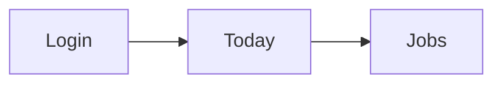
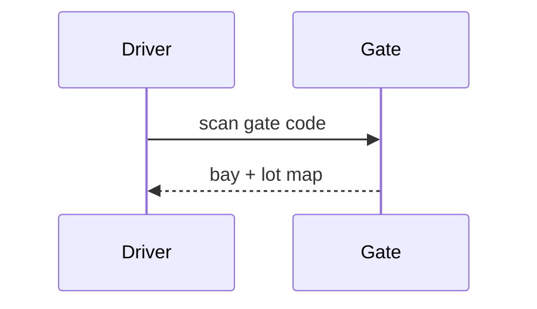

<!-- marver:managed 6225d94713a024de9f628141633dfa2930fa15a1e53521ad525f3fb8b9d58b8a - edit freely: init preserves your edits and stages upstream updates at design/.local/latest/ for you to merge. Delete this line to detach this file from updates entirely. -->

# Shape - an idea needs thinking before it needs screens

Run this when the human wants to think a feature through on the canvas - specs,
workflows, mood boards, inspiration - or when meaty new work deserves visual
alignment before wireframes. In a FIRST session it runs only when the human
chose it at the welcome/setup fork ("think it through together" / "start
something new, together") - never unprompted; the welcome flow owns the first
session and routes here. Discover stays the interview - questions, brief,
mode; Shape is the visual thinking surface built from its answers.

## The feature-story board

One board per feature, reading as the feature's whole story - thinking at the
top, structure in the middle, the answer at the bottom:

```
[ intent ]  [ flow diagram ]  [ spec ]  [ moodboard ]      <- scene: <feature>-specs
[ lo-fi list ]  [ lo-fi editor ]  [ lo-fi confirm ]        <- scene: <feature>-lofi
[ hi-fi ]      [ A variant ]  [ B variant ]                <- scene: <feature>
```

**One scene per phase, not one scene for everything.** `<feature>-specs`
(content frames), `<feature>-lofi` (wireframes), `<feature>` (the hi-fi
answer). Scenes are the canvas's grouping unit - phase scenes give the board
rows, the sidebar sections, and device keys a phase to act on.

**Spacing is meaning - compose the board with a recipe, deliberately:**

```json
"layout": {
  "rows": [ ["evening-specs"], { "space": 2 },
            ["evening-lofi"],  { "space": 4 },
            ["evening"] ],
  "scenes": { "evening": { "rows": [["list", { "space": 2 }, "editor"]] } }
}
```

- Graduate the gaps: a bigger space before the final hi-fi row than between
  thinking and structure - the answer deserves its own room.
- Space units are ADAPTIVE (proportional to the touching frames), so a gap
  between phone-sized rows needs a higher count than the same visual gap
  between big spec frames - which is why the example uses 4 before the hi-fi
  row and only 2 after the large specs. Judge the RENDERED gap, not the
  number.
- ALWAYS isolate a variant group from ordinary frames with `space: 2` or more
  on each touching side. Two similar-looking frames sitting near a normal one
  read as confusion; the gap is what says "these two are alternatives of one
  thing". (This rule is also in boards.md - it is binding, not taste.)

Content frames sit beside UI frames on the same board - ordinary atoms in the
board layout grammar (instructions/boards.md). Everything the canvas does -
selection, device keys, `d`, tidy, play, publish - works identically on them.

## Content frames - blocks, not markup

A content frame is a normal `.tsx` frame composed from marver's block
primitives. Import them directly in the frame file (not through a barrel -
detection is lexical), and declare `intent` on every content frame:

```tsx
import { Doc, Row, Col, Md, Diagram, Img, Chart } from "@marver-design/marver/content";

export const meta = {
  title: "Checkout - how it works",
  intent: "diagram",
  description: "The agreed flow, five screens - the source for the wireframes",
};

export default () => (
  <Doc layout="wide">
    <Row>
      <Diagram title="Checkout flow">{`
        flowchart LR
          Cart --> Pay --> Confirm
      `}</Diagram>
      <Col>
        
        <Md>{`### Why payment before account\nDropoff data says... see the [cart](goto:checkout/cart).`}</Md>
      </Col>
    </Row>
  </Doc>
);
```

- `Doc` is the frame root: `layout="document"` (readable column, 760) or
  `"wide"` (1280). It owns the outer padding and reports its height - the
  frame sizes itself to its content on the canvas.
- `Row` / `Col` / `Space` are the board vocabulary at frame scale - flex lanes
  with gap units (`space={n}`, one-off gaps via `<Space n={2} />`). Rows wrap
  on narrow devices, so responsiveness is free. This RHYMES with the board
  layout grammar; it is not the same grammar - think flex, not lanes.
- `Md` renders theme-aware markdown. `[label](goto:scene/frame)` links jump
  the canvas to a real frame - cross-link specs and screens. Raw HTML is
  inert; images must be local `design/assets/` paths.
- `Diagram` is first-class Mermaid - it can be an entire frame. A parse error
  shows an in-frame card: fix the source, the frame heals live. Never hand-set
  colors or `%%{init}%%` themes - marver's palette is injected and source
  overrides are stripped.
- `Img` shows `design/assets/<src>` with an optional caption, ALWAYS in full at its
  natural aspect ratio - never cropped, never letterboxed. Size it by how many images
  share its `Row` (fewer = bigger), not by a fixed height. Blocks carry their own
  padding, border, and surface - never hand-manage spacing around them.
- `Chart` is Apache ECharts, the Diagram way: you write the ECharts `option`
  (any series - bar, line, pie, scatter, radar, gauge, heatmap, funnel, treemap,
  sunburst, sankey, boxplot), marver injects the house look - the frame's own ink
  and typeface, the accent, light and dark - and renders SVG, still at rest.
  `<Chart h={360} option={{ xAxis: {...}, yAxis: {...}, series: [...] }} />`.
  Never set colors, fonts or `animation` in the option: the theme owns them.
  Label inside the plot on narrow blocks (an outside pie label past the edge is
  dropped). Data comes from a fixture, never invented in the option.
- `Video` (`src`, `poster`) embeds a clip the same way: a design-asset file
  or an https direct URL. The poster is the frame at rest; omit it and marver
  renders one from the clip (`<clip>.poster.png` beside it). Still at
  rest; click the poster to play wherever the frame is live. `ratio="9 / 16"`
  for a vertical clip. A walkthrough recording or a competitor's motion belongs
  in a spec as a `Video`, never as a link the reader has to leave for.
- `intent` (`diagram` | `spec` | `moodboard` | `notes`) is the frame's PURPOSE,
  not its content mix - a frame with two diagrams and a paragraph is still the
  "diagram frame" if diagrams are why it exists. It drives the icon the human
  scans for in the sidebar.

## Choosing a diagram

Mermaid has real breadth: flowchart, sequence, state, class, user journey,
quadrant chart, git graph, gantt, timeline, mindmap, pie, sankey, and more.
Pick the visualization that fits the IDEA - a journey for experience thinking,
a quadrant for prioritization, a state diagram for lifecycle logic, a sequence
for API choreography. The syntax reference is the Mermaid docs:
https://mermaid.js.org/intro/ - pull the one page you need, apply, return.

**Two pieces of built-in sugar make a flowchart read well with zero fiddling -
use them, don't hand-roll their raw mermaid equivalents.**

_Label hierarchy (`::`)._ Write a node label as `Head :: gloss` and marver
renders the **head bold** on top with the gloss on a lighter, smaller line
below - no backticks, no `**`, no `<br>`. A box should scan as label-then-
detail, so lead with the actor and let the example follow:

```
flowchart LR
  S["Shipper :: the company that needs freight moved"]:::blue
  C["Carrier :: the trucking company that hauls it"]:::orange
  D["Driver :: the person behind the wheel"]:::purple
  S --> C --> D
```

_Family colors (`:::name`)._ Tag a node with a built-in family and it gets a
filled, on-brand color with a legible border in both themes - no `classDef`.
The SAME six names work in `Md` prose (`:blue[the shipper's world]`), so a
sentence and the diagram beside it read as one color language:
`blue orange purple green red gray`. Pick ONE family per concept and hold it
everywhere; reserve `gray` for the neutral/background actor. Never encode
meaning in color ALONE - the label carries it too.

The marver theme already accent-washes every default node (both modes), so a
plain flowchart looks designed with zero effort - never hand-set grays "to be
safe" and never re-theme (init directives are stripped anyway). Check in BOTH
themes (`d`).

## Images and mood boards

Images arrive through the conversation: the human dumps screenshots and links,
you file them into `design/assets/` (kebab-case names that say what the image
IS - `stripe-checkout-2col.png`, not `img4.png`) and compose the mood board -
`Row`s of `Img` blocks with captions, short `Md` notes between them. Nothing
is ingested without intent. Always give an `Img` a caption or alt.

Go get assets yourself too: when the human names an inspiration ("like Stripe's
checkout", "Linear's sidebar") and you have web access, FETCH the real thing -
screenshots, official brand logos, product visuals - download into
`design/assets/` and place them. A mood board of real fetched imagery beats one
of described imagery every time (the full asset rules: instructions/craft.md,
"Real assets").

**Size images to be SEEN - by row grouping, never by cropping:**

- The image IS the content: it always renders in FULL at its natural aspect ratio, so
  a screenshot stays fully legible and is never sliced. You size it by how many images
  share a `Row` - fewer per row = larger. Give a detailed screenshot its own row or a
  pair; let small supporting shots share a row of three or four. An image that renders
  as a stamp is a defect - pull it into a shorter row.
- A row of same-aspect images (e.g. app screenshots, all the same window shape) lines
  up as one set on its own: equal column width + equal aspect = equal height, with no
  fixed-height prop. Only mixed aspects read ragged - split those into their own rows
  by shape rather than forcing a height (forcing one would crop or letterbox the shot).
- Reach for `layout="wide"` on image-heavy reference frames so each shot has room, and
  never set a frame height - the frame auto-heights to fit everything the canvas
  measures. Marver renders images crisp and zooms fast, so fine detail is one zoom away.
- Judge on the RENDER, not the props: after composing, look at the actual frame
  (`npx marver shot --scene <scene>` shoots the whole scene in one go; instructions/jam.md
  has the shell-less way) and adjust the per-row count until it reads well. "The code
  says they're the same width" proves nothing.

## Sticky notes - the aside beside a frame

A sticky note is one markdown file beside the thing it explains. It renders as a yellow note
left of the frame on the canvas, in dev and in every published or shared canvas. Nothing to
declare, no board node, no imports, no iframe:

| For                                                             | Write                                 | Shows                                                  |
| --------------------------------------------------------------- | ------------------------------------- | ------------------------------------------------------ |
| a frame `checkout/cart` (`cart.tsx`, `cart.jsx` or `cart.html`) | `design/scenes/checkout/cart.note.md` | left of that frame, 260 wide                           |
| a scene `checkout`                                              | `design/scenes/checkout/_note.md`     | left of the scene's first frame on the board, 380 wide |
| a component frame                                               | `design/components/<name>.note.md`    | as a frame note                                        |

Write one when a reader needs something the screen cannot say: what the frame is for, what
differs between two variations, how a mechanism works, an open question. Markdown, the Md
block's rules: `[text](goto:scene/frame)` links jump to a frame on the canvas, `http(s)`
links open a new tab, images are `design/assets/` paths, raw HTML is inert, and a
` ```mermaid ` fence renders hand-drawn, in the note's own yellow. Readers can comment on any
element of a note exactly as on a frame element.

Placement is not your job: the canvas keeps the room. Every layout the shell composes - a
board's `layout` recipe, the auto board, tidy, device views - reserves the note's width and
gutter in front of its frame, and its height below it: a note longer than its frame runs on
under the card and the next row starts under the note. When a note lands on a board that is
already composed (open or not), or grows, the recipe re-applies and the frames make way. Never
move frames, pad a lane or measure a gap for a note, sideways or down: write the file and the
board takes care of it. Only a board the human dragged by hand keeps its positions as they
are; their `t` makes the room there.

````md
## Why the jobs list leads

Drivers ask "where am I going first" - the list beats the map here.
Compare with the [empty day](goto:app-home/today-empty): same header, one call to action.

| Reason  | Effect           |
| ------- | ---------------- |
| Too far | lane weight down |


````

### Diagrams in a note

A ```mermaid fence in a note renders hand-sketched on the yellow paper: rough boxes, hatched
fills, handwriting labels, one ink. You write plain mermaid and nothing else - no `%%{init}%%`,
no theme, no colours, no `style` lines (the note has one look and applies it to every family),
no URLs or images in the source (refused). Every family works: flowchart, sequence, state,
class, ER, pie, mindmap, timeline, gantt, journey, quadrant, git graph, block.

Fit the note: flowchart (`TD` for a tall note, `LR` for three or four steps), sequence, state,
class, ER, pie and mindmap read well at 260 or 380 wide. Gantt, journey, timeline, quadrant and
git graphs are drawn at the note's width too but are wide by nature - keep them to a handful of
items, or give them a content frame. Five to eight nodes is the sweet spot; short labels
(two or three words); one diagram per note, above or below the prose it explains.



Keep it an aside: a screen's worth of reading at most. The spec, the flow, the mood board stay
content frames - a note explains, it does not document. Every viewer can fold a note to its
corner tab (the choice is theirs, never saved to the board) and hide all of them with `N`.
Edits to a note file land on the canvas as you save, without reloading the frame.

## When Shape ends

The board holds the agreed flow, spec, and direction. Wireframe picks up from
there (the spec IS the brief - do not re-interview), then Brand, then Build.
The content frames stay on the board: the feature's documentation lives beside
its screens, and both publish together.
